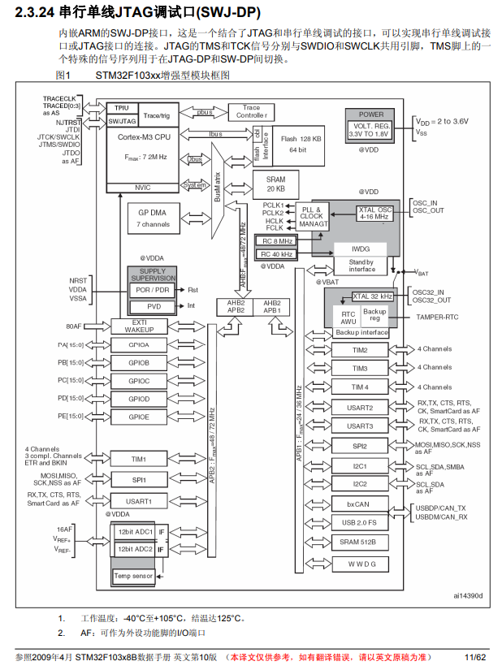
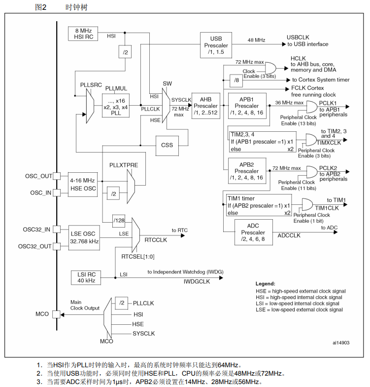
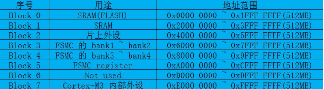
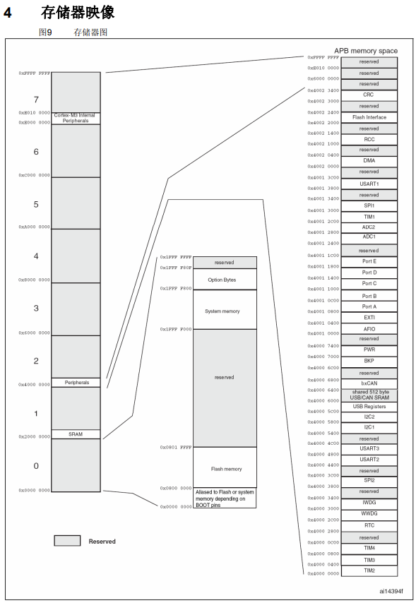
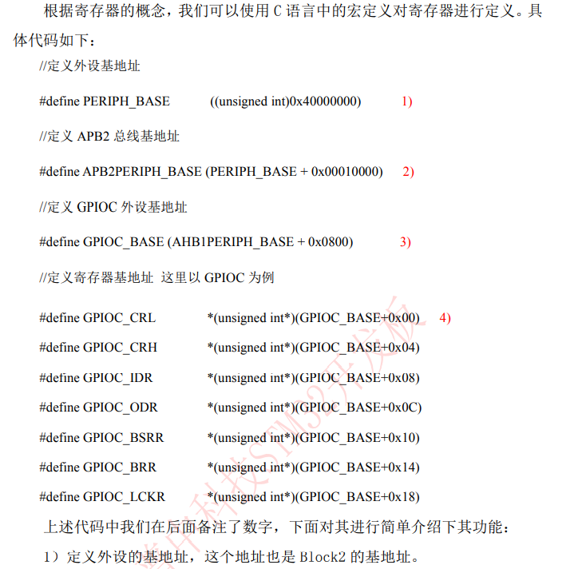
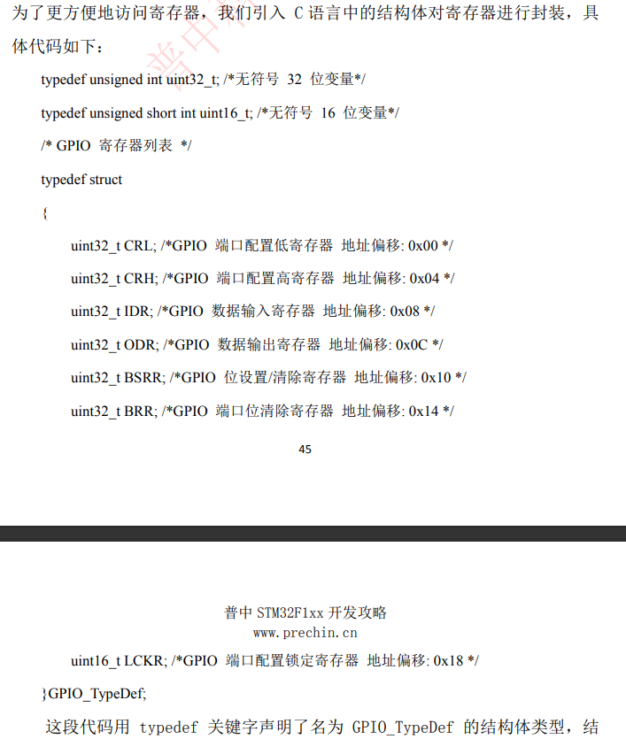

## STM32F103C8 的特性

|              |                     |
| ------------ | ------------------- |
| 最高工作频率 | 72MHZ               |
| 存储器       | 64K Falsh; 20K SRAM |

## 系统时钟和启动

- 上电复位或启动时 CPU 默认选择内部 8MHz 的 RC 振荡器作为 CPU 时钟；
  - 当然，启动之后可以设置成外部晶振，PLL，或内部低速时钟等时钟作为 CPU 时钟

|                           |                                                     |
| ------------------------- | --------------------------------------------------- |
| STM32F103xx增强型模块框图 |  |
| STM32F103xx时钟树         |       |

## 供电方案

- VDD = 2.0～3.6V：VDD引脚为I/O引脚和内部调压器供电。
- VSSA，VDDA = 2.0～3.6V：为ADC、复位模块、RC振荡器和PLL的模拟部分提供供电
  - 使用ADC时，VDDA不得小于2.4V。
  - VDDA和VSSA必须分别连接到VDD和VSS。
- VBAT = 1.8～3.6V：当关闭VDD时，(通过内部电源切换器)为RTC、外部32kHz振荡器和后备寄存器供电

## 定时器和看门狗

- 1个高级控制定时器（TIM1）
- 3个普通定时器（TIM2,TIM3,TIM4）
- 2个看门狗定时器（独立看门狗，窗口看门狗）
  - 独立看门狗：12位递减计数器，8位预分频；还可用作复位，超时管理等
  - 窗口看门狗：7位递减计数器，只可以用作看门狗，复位系统
- 1个系统嘀嗒定时器：24位递减计数器，Cortex-M3 内核产生

## 存储器

### 存储器区域划分

STM32 是 ARM 内核的；STM32F103 是 M3 内核，STM32F407 是 M4 内核；
ARM 公司本身定义了一个 4G 的存储器，用来更好的扩展；4G 空间分成 8 个块，每个块 512MB；每块都有特殊的用途；STM 公司只用到了前几个块

- Block 0：存放 Flash；自举程序；芯片选项字节
- Block 1：存放 SRAM
- Block 2：存放 片上外设
- Block 3/4/5：存放 FSMC 用于拓展外部存储器，SRAM，NORFLASH等

|                      |                                                     |
| -------------------- | --------------------------------------------------- |
| ARM 内部的存储器分块 |        |
| STM32F103 使用到的块 |  |

- Flash memory address: [0x08000000,0x0801FFFF]
- Peripherals address: [0x40000000,0x40023400]

注意：自举程序就是通过 BOOT0 和 BOOT1 选择启动程序是从串口接口烧录程序或是主闪存启动程序

### 寄存器

- 低速设备挂载在 APB1 总线上，高速设备挂载在 APB2，AHB 总线上；
- STM32 库访问寄存器的方式是：总线基地址 + 相对偏移地址
- STM32 库设置寄存器内容，用到 C 语言的指针，通过指针访问地址内容
- STM32 库使用结构体对封装寄存器，便于使用

|            |                                             |
| ---------- | ------------------------------------------- |
| 寄存器指针 |  |
| 寄存器封装 |   |

## 创建新工程

### 使用寄存器模板

一个工程必须的文件

- 启动文件 startup_stm32f10x_hd.s 和 startup_stm32f10x_md.s 都可以
  - startup_stm32f10x_hd.s 是大容量的芯片有更多的外设定义
  - startup_stm32f10x_md.s 是中容量的芯片，外设定义少一些
  - STM32 是向下兼容的，所以，使用 startup_s tm32f10x_hd.s 就可以
- stm32F10x.h 芯片头文件，包含芯片内部的寄存器定义，内核等内容
  - 这个头文件提示需要包含 “core_cm3.h” 内核文件
- main.c 主函数
  - 需要定义一个方法 SystemInit(); 因为启动文件 startup_stm32f10x_hd.s 是先从 SystemInit 方法启动的；
- 最简易的工程就创建完了

#### GPIO 知识点补充

- IO口输出端保护二极管
  - 如果外部电压高，则 VDD 导通；
  - 如果外部电压低，则 VSS 导通；
  - 这样就可以避免不正常的电压输入
- 上下拉电阻；上拉，下拉，浮空；
  - stm32 是弱上拉；弱上拉指输出电流很小，需要外接驱动管
- P-Mos 和 N-Mos 的输出模式
  - 推挽输出：当输出波形时，推挽输出可以快速导通
    - N(PNP) 管接VDD，负责灌电流；灌电流是电流输出到负载
    - P(NPN) 管接VSS，负责拉电流；拉电流是电流流向芯片
    - 推挽输出一般应用在，需要高速切换 IO 开关状态的场合；或不需要开漏的场合
  - 开漏输出：N 管始终关闭的，当设置为低，P 管导通，接地；设置为高，P 管截止，是高组态
    - 开漏输出的高电平，必须外部接上拉电阻，否则是高组态
    - 开漏输出具有 “线与” 的特点；即：所有接开漏输出引脚的电平都为低，总线才为低
    - 可以接3.3V 或 5V 需要查看 STM32 引脚是否支持 5V 电压
    - 开漏输出一般应用在 I2C、SMBUS 通信等需要 ”线与“ 的总线电路中
- 模拟信号输入：IO 口信号不经过 TTL施密特触发器，直接输入原始模拟信号
- STM32 在输出模式下 TTL施密特触发器是打开的，所以，可以通过 IDR 寄存器读取输入高低电平
- STM32 复用功能
  - 输出有用，速度有用，开漏或推挽有用，但是，输出控制 ODR 没有用，由外设输出信号高低
  - 输入有用，可以获取 IO 状态，但是，一般用外设获取数据信号
- 模拟输入输出
  - 上下拉电阻无影响，不会影响模拟信号
  - 双 MOS 管关闭，施密特触发器关闭，上下拉电阻禁用
  - 只有模拟通道进行输入输出

#### startup_stm32f10x_hd.s 文件介绍

- SystemInit(); 是启动文件包含的，必须存在
  - 一般初始化 STM32 芯片的时钟，包括 AHB、APB 等总线的时钟
  - 系统上电会先执行 SystemInit() 设置时钟，再进入 main() 执行代码

#### Keil 编译后 Flash 和 SRAM 大小

STM32F03C8 的 Flash 是 64K 字节; SRAM 是 20K 字节；
Flash 大小 = Code + RO-data 对应的单位是字节；SRAM 大小 = RW-datata 对应的单位是字节

- Code：表示程序所占用 FLASH 的大小
- RO-data：即 Read Only-data，表示程序定义的常量，存储在 FLASH 内
- RW-data：即 Read Write-data，表示已被初始化的变量，存储在 SRAM 内
- ZI-data：即 Zero Init-data，表示未被初始化的变量，存储在 SRAM 内

### 使用库函数模板

CMSIS：Cortex MicroController Software Interface Standard，Cortex微控制器软件接口标准

- CMSIS 处于中间层，向上提供函数接口由用户调用，向下负责内核和其他外设通信
- 使用 CMSIS-Mx 内核的芯片不只有 STM32，所以这套标准是为了统一接口
- 这套标准被 STM 公司封装到 STM32 固件库中，用户使用固件库操作 CMSIS

#### 固件库的文件夹介绍

- Libraries：存放的是源文件
  - CMSIS: 存放 ARM CMSIS 的内核文件，STM32 启动文件，对应外设头文件 stm32f10x.h
  - STM32F10x_StdPeriph_Driver: 存放 STM32 外设驱动文件
    - inc：外设头文件
    - src：外设源文件
    -