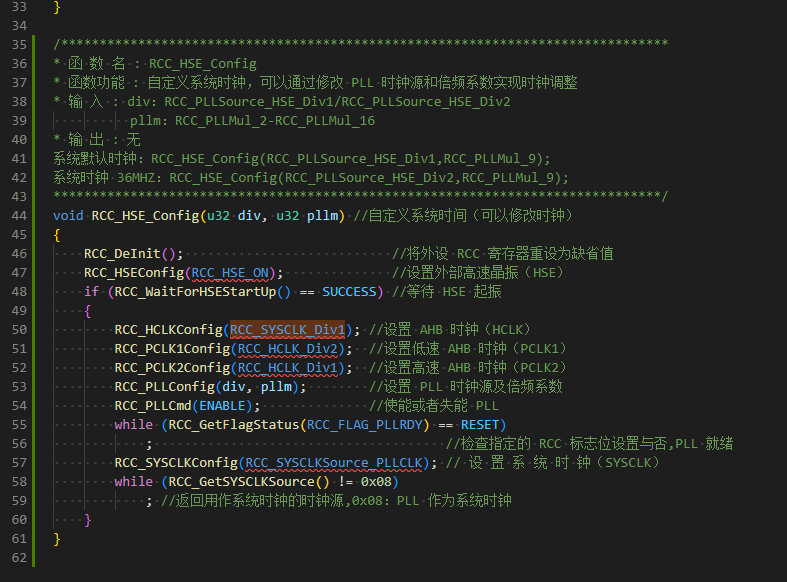

## STM32F103C8 的特性

|              |                     |
| ------------ | ------------------- |
| 最高工作频率 | 72MHZ               |
| 存储器       | 64K Falsh; 20K SRAM |

## 系统时钟和启动

- 上电复位或启动时 CPU 默认选择内部 8MHz 的 RC 振荡器作为 CPU 时钟；
  - 当然，启动之后可以设置成外部晶振，PLL，或内部低速时钟等时钟作为 CPU 时钟

|                           |                                                     |
| ------------------------- | --------------------------------------------------- |
| STM32F103xx增强型模块框图 |  |
| STM32F103xx时钟树         |       |

## 供电方案

- VDD = 2.0～3.6V：VDD引脚为I/O引脚和内部调压器供电。
- VSSA，VDDA = 2.0～3.6V：为ADC、复位模块、RC振荡器和PLL的模拟部分提供供电
  - 使用ADC时，VDDA不得小于2.4V。
  - VDDA和VSSA必须分别连接到VDD和VSS。
- VBAT = 1.8～3.6V：当关闭VDD时，(通过内部电源切换器)为RTC、外部32kHz振荡器和后备寄存器供电

## 定时器和看门狗

- 1个高级控制定时器（TIM1）
- 3个普通定时器（TIM2,TIM3,TIM4）
- 2个看门狗定时器（独立看门狗，窗口看门狗）
  - 独立看门狗：12位递减计数器，8位预分频；还可用作复位，超时管理等
  - 窗口看门狗：7位递减计数器，只可以用作看门狗，复位系统
- 1个系统嘀嗒定时器：24位递减计数器，Cortex-M3 内核产生

## 存储器

### 存储器区域划分

STM32 是 ARM 内核的；STM32F103 是 M3 内核，STM32F407 是 M4 内核；
ARM 公司本身定义了一个 4G 的存储器，用来更好的扩展；4G 空间分成 8 个块，每个块 512MB；每块都有特殊的用途；STM 公司只用到了前几个块

- Block 0：存放 Flash；自举程序；芯片选项字节
- Block 1：存放 SRAM
- Block 2：存放 片上外设
- Block 3/4/5：存放 FSMC 用于拓展外部存储器，SRAM，NORFLASH等

|                      |                                                     |
| -------------------- | --------------------------------------------------- |
| ARM 内部的存储器分块 |        |
| STM32F103 使用到的块 |  |

- Flash memory address: [0x08000000,0x0801FFFF]
- Peripherals address: [0x40000000,0x40023400]

注意：自举程序就是通过 BOOT0 和 BOOT1 选择启动程序是从串口接口烧录程序或是主闪存启动程序

### 寄存器

- 低速设备挂载在 APB1 总线上，高速设备挂载在 APB2，AHB 总线上；
- STM32 库访问寄存器的方式是：总线基地址 + 相对偏移地址
- STM32 库设置寄存器内容，用到 C 语言的指针，通过指针访问地址内容
- STM32 库使用结构体对封装寄存器，便于使用

|            |                                             |
| ---------- | ------------------------------------------- |
| 寄存器指针 |  |
| 寄存器封装 |   |

## 创建新工程

### 使用寄存器模板

一个工程必须的文件

- 启动文件 startup_stm32f10x_hd.s 和 startup_stm32f10x_md.s 都可以
  - startup_stm32f10x_hd.s 是大容量的芯片有更多的外设定义
  - startup_stm32f10x_md.s 是中容量的芯片，外设定义少一些
  - STM32 是向下兼容的，所以，使用 startup_s tm32f10x_hd.s 就可以
- stm32F10x.h 芯片头文件，包含芯片内部的寄存器定义，内核等内容
  - 这个头文件提示需要包含 “core_cm3.h” 内核文件
- main.c 主函数
  - 需要定义一个方法 SystemInit(); 因为启动文件 startup_stm32f10x_hd.s 是先从 SystemInit 方法启动的；
- 最简易的工程就创建完了

#### GPIO 知识点补充

- IO口输出端保护二极管
  - 如果外部电压高，则 VDD 导通；
  - 如果外部电压低，则 VSS 导通；
  - 这样就可以避免不正常的电压输入
- 上下拉电阻；上拉，下拉，浮空；
  - stm32 是弱上拉；弱上拉指输出电流很小，需要外接驱动管
- P-Mos 和 N-Mos 的输出模式
  - 推挽输出：当输出波形时，推挽输出可以快速导通
    - N(PNP) 管接VDD，负责灌电流；灌电流是电流输出到负载
    - P(NPN) 管接VSS，负责拉电流；拉电流是电流流向芯片
    - 推挽输出一般应用在，需要高速切换 IO 开关状态的场合；或不需要开漏的场合
  - 开漏输出：N 管始终关闭的，当设置为低，P 管导通，接地；设置为高，P 管截止，是高组态
    - 开漏输出的高电平，必须外部接上拉电阻，否则是高组态
    - 开漏输出具有 “线与” 的特点；即：所有接开漏输出引脚的电平都为低，总线才为低
    - 可以接3.3V 或 5V 需要查看 STM32 引脚是否支持 5V 电压
    - 开漏输出一般应用在 I2C、SMBUS 通信等需要 ”线与“ 的总线电路中
- 模拟信号输入：IO 口信号不经过 TTL施密特触发器，直接输入原始模拟信号
- STM32 在输出模式下 TTL施密特触发器是打开的，所以，可以通过 IDR 寄存器读取输入高低电平
- STM32 复用功能
  - 输出有用，速度有用，开漏或推挽有用，但是，输出控制 ODR 没有用，由外设输出信号高低
  - 输入有用，可以获取 IO 状态，但是，一般用外设获取数据信号
- 模拟输入输出
  - 上下拉电阻无影响，不会影响模拟信号
  - 双 MOS 管关闭，施密特触发器关闭，上下拉电阻禁用
  - 只有模拟通道进行输入输出

#### startup_stm32f10x_hd.s 文件介绍

- SystemInit(); 是启动文件包含的，必须存在
  - 一般初始化 STM32 芯片的时钟，包括 AHB、APB 等总线的时钟
  - 系统上电会先执行 SystemInit() 设置时钟，再进入 main() 执行代码

#### Keil 编译后 Flash 和 SRAM 大小

STM32F03C8 的 Flash 是 64K 字节; SRAM 是 20K 字节；
Flash 大小 = Code + RO-data 对应的单位是字节；SRAM 大小 = RW-datata 对应的单位是字节

- Code：表示程序所占用 FLASH 的大小
- RO-data：即 Read Only-data，表示程序定义的常量，存储在 FLASH 内
- RW-data：即 Read Write-data，表示已被初始化的变量，存储在 SRAM 内
- ZI-data：即 Zero Init-data，表示未被初始化的变量，存储在 SRAM 内

### 使用库函数模板

CMSIS：Cortex MicroController Software Interface Standard，Cortex微控制器软件接口标准

- CMSIS 处于中间层，向上提供函数接口由用户调用，向下负责内核和其他外设通信
- 使用 CMSIS-Mx 内核的芯片不只有 STM32，所以这套标准是为了统一接口
- 这套标准被 STM 公司封装到 STM32 固件库中，用户使用固件库操作 CMSIS

#### 固件库的文件夹介绍

- Libraries：存放的是源文件
  - CMSIS: 存放 ARM CMSIS 的内核文件，STM32 启动文件，对应外设头文件 stm32f10x.h
  - STM32F10x_StdPeriph_Driver: 存放 STM32 外设驱动文件
    - inc：外设头文件
    - src：外设源文件
- Project：存放官方的固件程例
  - STM32F10x_StdPeriph_Examples：ST 公司提供的外设驱动例程
  - STM32F10x_StdPeriph_Templates：固件库工程模板
- STM32F10x_StdPeriph_Templates：固件库帮助文档

#### 文件介绍

- stm32f10x.h 这个是芯片头文件，存放总线，内存，外设寄存器等
  - 包含 core_m3.h: CMSIS 核心文件，是 M3 内核的驱动（\Libraries\CMSIS\CM3\CoreSupport）
  - 包含 system_stm32f10x.h， system_stm32f10x.c: 是系统的总线时钟和 SystemInit() 函数声明（\Libraries\CMSIS\CM3\CoreSupport）
- startup_stm32f10x_hd.s: 启动文件,放堆栈大小，中断入口等（Libraries\CMSIS\CM3\DeviceSupport\ST\STM32F10x\startup\arm）
- stm32f10x_it.c，stm32f10x_it.h：存放中断函数，一般把中断函数放到，别的地方（Project\STM32F10x_StdPeriph_Template）
- stm32f10x_conf.h: 配置文件，删减外设头文件（Project\STM32F10x_StdPeriph_Template）
- main.c: 主函数

#### 魔术棒的配置

STM32为什么要在C/C++配置里写STM32F10X_HD,USE_STDPERIPH_DRIVER详解

- 参考网址： https://blog.csdn.net/wzx104104104/article/details/106327107
- 宏定义 USE_STDPERIPH_DRIVER： 用来设置是否使用 stm32f10x_conf.h
  - 之前，在 main() 中没有包含外设头文件，但是编译过后有包含就是因为这个宏定义
- 宏定义 STM32F10X_HD： 定义芯片的类型，高容量，中容量等
  - 这个宏定义，可以选择不同的外设中断函数

STM32F103C8T6 是中容量的芯片，理论上启动文件应该是 startup_stm32f10x_md.s

- 如果使用 startup_stm32f10x_hd.s 文件，会报错
  - 应该修改宏定义 STM32F10X_HD -> STM32F10X_MD
  - 或者直接删除宏定义 STM32F10X_HD
- 最正确的应该是使用 startup_stm32f10x_md.s 并且修改宏定义 STM32F10X_MD

不能有两个 SystemInit() 函数

- 在文件 system_stm32f10x.c 中已经定义了 SystemInit() 函数，用来定义系统时钟

#### 启动文件（startup_stm32f10x_md.s）的介绍

启动文件分配栈空间和堆空间，和 SystemInit() 和 main()

- 栈： 程序开头分配的是栈空间 Stack
  - Stack_Size: 0x00000400 = 1KB 的空间
  - 栈的大小不能超过内部 RAM 大小，STM32F03C8 的 RAM = 20KB
  - 栈主要存放函数的参数值，局部变量的值
  - 如果程序中局部变量使用较多，可能会导致栈溢出，出现莫名奇怪的错误
  - 通常可以改栈值，使栈空间更大一些
  - 栈的生长方式由高到低
- 堆： Heap_Size: 0x00000200 = 512B
  - 堆一般由程序员分配和释放
  - 程序结束可由操作系统回收
  - 堆的生长方式是由低向高
  - 类似于数据结构的链表

### 时钟树的一些知识点

- SysTick 是 SYSCLK 通过 8 分频后送给 Cortex 系统定时器 SysTick
- APB1 挂接的是低速外设； APB2 挂接的是高速外设
  - APB2 最大 72MHX：UART1、 SPI1、 Timer1、 ADC1、 ADC2、GPIO等
  - APB1 最大 36MHZ：电源接口、备份接口、CAN、USB、I2C1、I2C2、UART2、UART3等
  - 注意：Timer1，Timer2，Timer3 如果分频不是 1；时钟会自动 *2

SystemInit 函数的介绍

- STM32F103 上电的复位之后，默认使用 HSI 作为系统时钟
- 然后设置相关寄存器切换成 HSE 作为系统时钟
  - 如果，外部晶振开启成功，则 HSE 作为系统时钟
  - 如果，外部晶振开启失败，则 HSI 作为系统时钟
- 可以修改宏定义 HSE_VALUE 修改对应的板子上外部晶振的频率值
  - 最小系统板上面的外部晶振也是 8MHZ，所以这里不用修改
- system_stm32f10x.c 中定义了宏 SYSCLK_FREQ_72MHz，即默认系统时钟是 72MHZ
  - SYSCLK（系统时钟） =72MHz
  - AHB 总线时钟(HCLK=SYSCLK) =72MHz
  - APB1 总线时钟(PCLK1=SYSCLK/2) =36MHz
  - APB2 总线时钟(PCLK2=SYSCLK/1) =72MHz
  - PLL 主时钟 =72MHz

#### stm32f10x_rcc.c 用来使能时钟

时钟函数大致分为三类：

- 外设时钟使能
  - void RCC_AHBPeriphClockCmd(uint32_t RCC_AHBPeriph, FunctionalState NewState);
  - void RCC_APB2PeriphClockCmd(uint32_t RCC_APB2Periph, FunctionalState NewState);
  - void RCC_APB1PeriphClockCmd(uint32_t RCC_APB1Periph, FunctionalState NewState);
- 时钟源和倍频因子配置函数
  - void RCC_HSICmd(FunctionalState NewState);
  - void RCC_LSICmd(FunctionalState NewState);
  - void RCC_PLLCmd(FunctionalState NewState);
  - void RCC_RTCCLKCmd(FunctionalState NewState);
  - RCC_SYSCLKConfig(RCC_SYSCLKSource_HSE);//配置时钟源为 HSE
  - RCC_PCLK1Config(RCC_HCLK_Div2);//设置低速 APB1 时钟(PCLK1)
- 外设复位函数
  - void RCC_APB1PeriphResetCmd(uint32_t RCC_APB1Periph, FunctionalState NewState);
  - void RCC_APB2PeriphResetCmd(uint32_t RCC_APB2Periph, FunctionalState NewState)
- 获取时钟源配置函数

#### 自定义系统时钟

STM32 上电默认使用的是 HSI（8MHZ） 作为系统时钟，然后检测 HSE（8MHZ），如果 HSE 起振正常，那么系统时钟使用 HSE + PLL 倍频后的 72MHZ，然后，设置 AHB 使用系统时钟 1 分频，即 72MHZ；设置 APB1，APB2 的时钟是由高速 AHB 时钟分频得到，APB1 对 AHB 两分频，即 36MHz，APB2 对 AHB 一分频，即 72MHZ；

- 上面的是系统默认对系统时钟的配置，也可以自己定义系统时钟
  - 自定义系统时钟参考原代码 RCC_HSE_Config()
  - 系统默认设置，对应函数参数：RCC_HSE_Config(RCC_PLLSource_HSE_Div1,RCC_PLLMul_9);
  - 设置系统时钟 36MHZ，对应函数参数：RCC_HSE_Config(RCC_PLLSource_HSE_Div2,RCC_PLLMul_9);

如何查看系统及总线时钟

- 参考网址：https://blog.csdn.net/Williamcsj/article/details/106799273

使用固件库函数 RCC_GetClocksFreq() 可以获取到系统及总线的时钟数据，然后通过 ST-Link 等调试工具可以查看这里的数据

|                                                        |                                                     |
| ------------------------------------------------------ | --------------------------------------------------- |
|  |  |

### 位带操作

位带：STM32 是 32 位的单片机，一个寄存器有 32 个位，但是要想只操作一个位比较麻烦，所以，为了操作一个位，把寄存器中的每个位膨胀成一个32位的长的地址，对这个地址的操作就是对相应寄存器位的操作。

STM32F1 中有两个区域支持位带操作

- SRAM 区的最低 1MB 范围
  - [0x20000000,0x200FFFFF] 扩展到 [0x22000000,0x23FFFFFF]
  - AliasAddr=0x22000000+ (A-0x20000000) * 32 + n*4;(A 某个寄存器的地址，n 是寄存器的第几位（0-31）)
- 片内外设 区的最低 1MB 范围（APB1,APB2，AHB）
  - [0x40000000,0x400FFFFF] 扩展到 [0x42000000,0x43FFFFFF]
  - AliasAddr=0x42000000+ (A-0x40000000) * 32 + n*4;(A 某个寄存器的地址，n 是寄存器的第几位（0-31）)
- 通常我们只使用外设区位带操作，很少使用 SRAM 区位带操作

两个区域的位带操作合并：

- #define BITBAND(addr, bitnum) ((addr & 0xF0000000)+0x2000000+((addr&0xFFFFF)<<5）+(bitnum<<2)

把 addr 地址强制转换为 unsigned long 类型的指针

- #define MEM_ADDR(addr) *((volatile unsigned long *)(addr))

把位带别名区内地址转换为指针 ，获取地址内的数据

- #define BIT_ADDR(addr, bitnum) MEM_ADDR(BITBAND(addr, bitnum))

volatile 关键字修饰的变量，每次存取的时候都会直接从变量地址中操作，如果，没有使用volatile 修饰，则编译器可能会优化变量值，可能出现变量值设置不一致的情况

### SysTick 系统定时器
