## 如何下载程序到 STM32F103C8

- 使用串口 FlyMcu
- 使用 ISP(PZ-ISP)
- 使用 SWD 下载程序
- 使用 ST-Link
- 使用普中 STM32 仿真，CMSIS-DAP

## ST-Link, J-Link, U-Link; SWD, JTAG, SWIM 以及串口之间的联系与区别

参考网址：

- https://blog.csdn.net/m0_46170433/article/details/105883593

### 串口

- 串口有多种：
  - 异步串口 UART; UART包含TTL电平的串口和RS232电平的串口
  - 一般UART通常是指TTL电平的串口
  - UART，RS232，RS485 都是串口，但是电器标准及协议不同

- TTL电平和RS-232电平
  - Uart，使用的是TTL电平，定义-3.3V-0为低电平-L(0)，而0~+3.3V为高电平-H(1)
  - 一般PC端用的串口是RS232串口，RS232是负逻辑电平，它定义+5 -+12V为低电平-L(0)，而-12~-5V为高电平-H(1)
  - 由于 Uart 和 RS232 的电平逻辑不同，所以，需要中间转换的芯片，CH340G，MAX232
  - CH340G，USB 转 TTL 串口，需要 CH340 驱动，虚拟出 COM 口
  - SP3232，RS232 转 TTL 型，专为 RS232 标准串口设计

- RS232 和 RS485 区别
  - RS232 是点对点的通信，只有一对收发，适合本地设备之间短距离通信
  - RS-485 是多点双向通信，只能有一个主机（master），其他为从机，最多可连接32个设备，最大传输距离是1219米，传输速率为 10Mb/s

### 芯片烧录方式

- ISP 下载
  - ISP 原因：芯片厂商会在MCU内部封装 ISP 功能，为了更方便的下载程序节约成本
  - ISP 是什么：在线系统编程，可以把 code 烧录/下载到MCU上
  - ISP 下载：需要 ISP 上位机软件（PZ-ISP），USB 转 TTL 连接电脑和 MCU
  - 优点：方便，成本低
  - 缺点：不能在线调试，只能烧录/下载

- 串口下载
  - 串口下载原因：MCU 厂商会预留一段启动程序，这段启动程序就是 ISP 引导程序，具有这段启动程序才能使用串口下载程序
  - MCU 上电会根据启动程序判断是使用串口下载，或是 ISP 下载
  - 串口下载：需要 串口上位机（FlyMcu），USB 转 TTL 连接电脑和 MCU
  - 串口和ISP的优缺点差不多
  - STM8 和 C51：单片机上电先运行 ISP 引导程序，如果没有监测 ISP上位机，则运行内部Flash 之前的下载的程序；如果有 ISP上位机，则下载程序；
  - STM32 根据 Boot0 和 Boot1 启动引脚的设置，MCU从不同的位置启动；

SWIM，JTAG，SWD 是 ARM 板上的调试模式：

- JTAG 协议
  - JTAG 是一种国际标准测试协议，重要用于芯片测试
  - JTAG 接口有4线：TMS，TCK，TDI，TDO
  - DSP 和 FPGA 等高级器件都支持 JTAG 协议

- SWD 串行调试
  - 也是一种调试协议，但不同于 JTAG
  - 2 条线，可靠性高，占用引脚少

- SWIM 主要是用在 STM8 在线调试模式
  - STM8 开发：使用 STVD（IDE开发环境） 和 STVP（烧录工具）

ST-Link，J-Link，U-Link 是硬件设备，是一种实际调试工具

- J-Link：就是一个 JTAG 协议转换盒，PC 用 USB 连接J-Link，J-Link 连接 MCU；
  - 支持 JTAG 协议的芯片，都可以使用 J-Link 来在线调试和下载

- ST-Link-V2 专门针对ST公司的 STM8 和 STM32 系列芯片的仿真器
  - 可以使用接口：SWIM，SWD，JTAG
  - 可以在线调试和下载

## ST-Link 的版本，及其差异

参考网址：

- https://blog.csdn.net/ybhuangfugui/article/details/88266399

|                             |                                                |
| --------------------------- | ---------------------------------------------- |
| ST-LinK                     | 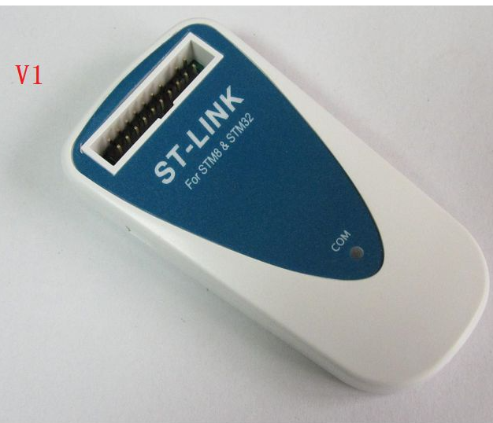 |
| ST-LinK/V2; ST-Link/V2-ISOL |  |
| ST-LinK/V3                  | 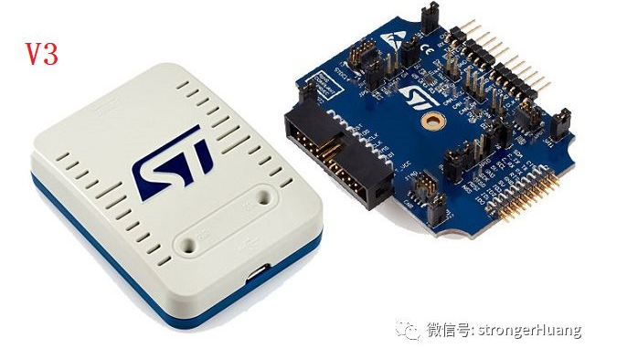 |

- ST-LinK: 老产品，目前使用不多
- ST-LinK/V2: ST-Link/V2-ISOL：使用较多
  - ST-LinK/V2：价格便宜，有许多山寨的，使用比较多
  - ST-Link/V2-ISOL：带 1000V 隔离，这一版本价格贵
- ST-LinK/V3：功能更强大

## CMSIS-DAP 调试器

参考网址：

- https://blog.csdn.net/ybhuangfugui/article/details/105020908
- https://www.amobbs.com/thread-5761725-1-1.html

市面上常见的下载调试器有：J-Link，ST-Link，还有一种 CMSIS-DAP Debugger

- CMSIS：Cortex Microcontroller Software Interface Standard，即Cortex微控制器软件接口标准
- DAP：Debug Access Port，调试访问端口

CMSIS-DAP 调试器是 Cortex-M MCU 内部封装的用于的调试的标准化接口，可以调试和追踪代码

- CMSIS-DAP 固件是以源码形式提供，软件硬件都是开源的

|                                                         |                                               |
| ------------------------------------------------------- | --------------------------------------------- |
| CMSIS-DAP 内部示意图                                    | 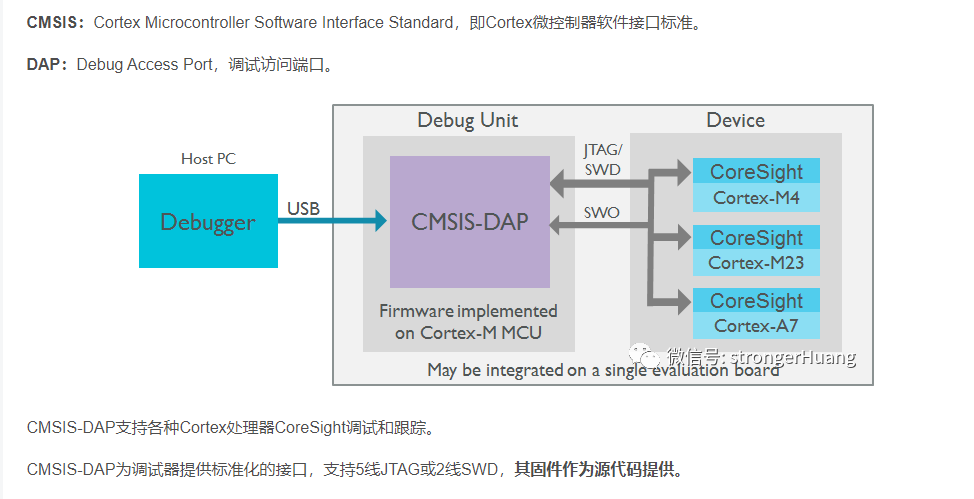 |
| JTAG，SWD以及串口都是通过这个 Cortex接口标准调试 MCU 的 | 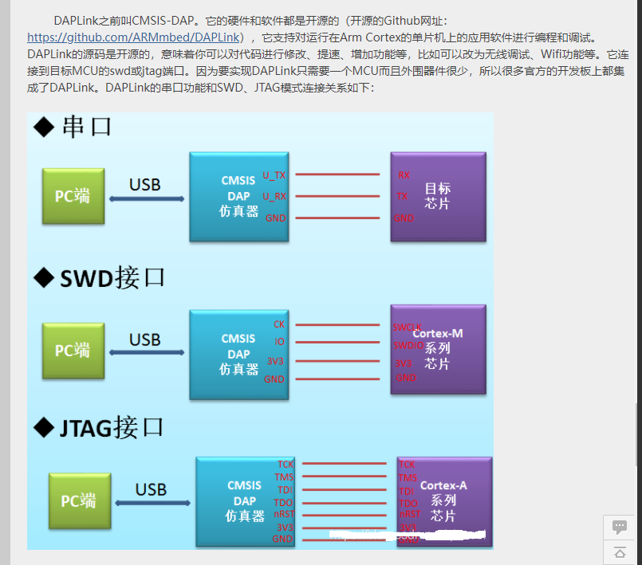  |

## 使用串口下载 SMT32F103 程序

参考网址:

- https://detail.tmall.com/item.htm?_u=i1qhgis7fb7e&id=626358704662
- https://www.cnblogs.com/leo0621/p/8478832.html
- https://blog.csdn.net/weixin_44226857/article/details/106303337

- 硬件: 芯片 CH340G 是 USB 转 TTL 模块, 也是 RS232 转串口;
  - CH340 配合上位机可以下载程序
  - 也可以当成 USART1 和串口助手通信
- 软件: FlyMcu 或 PZ-ISP(普中烧录软件)

|                           |                                       |
| ------------------------- | ------------------------------------- |
| CH340G 原理图(普中)       | 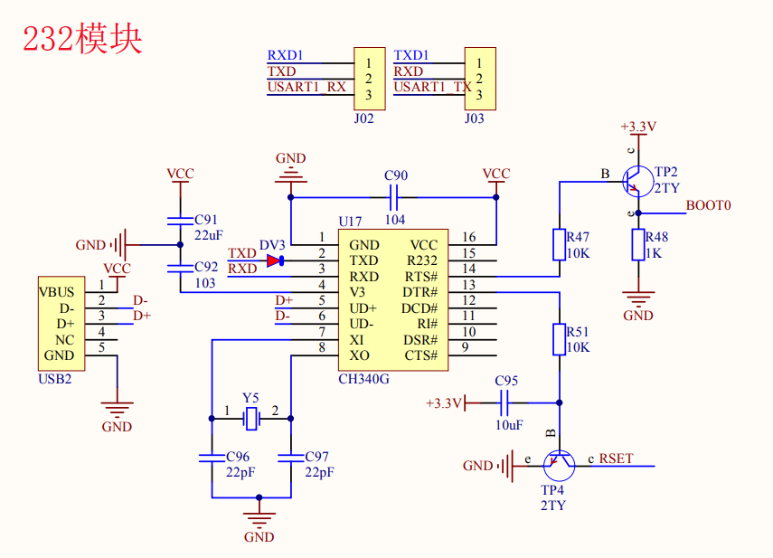       |
| CH340G 原理图(网上)       | 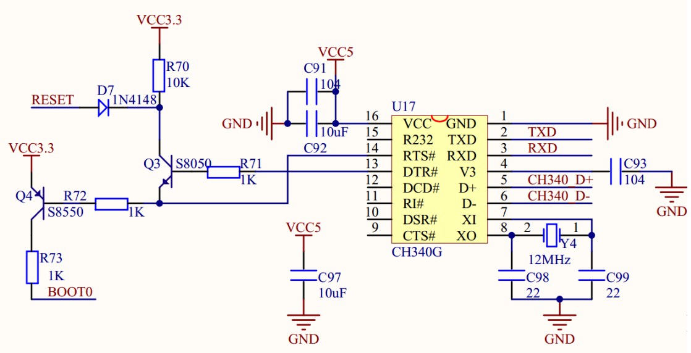 |
| CH340G 和 STM32F03 连接图 | 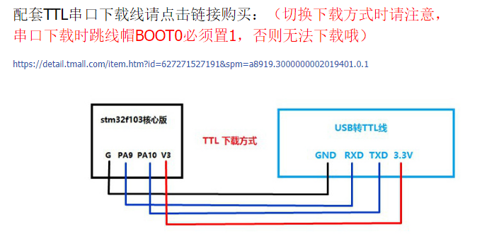      |
| Boot1 和 Boot0            | 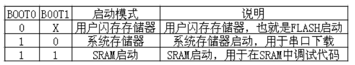         |
| PZ-ISP 下载成功           | 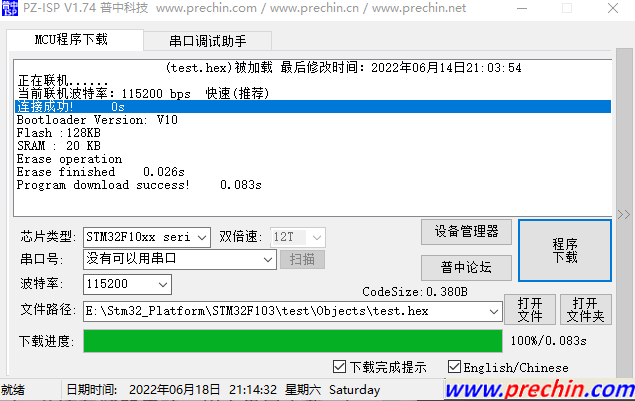     |
| FlyMCU 下载成功           | 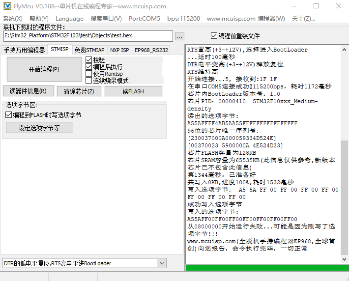     |

- 注意:
  - DTR 和 RST 的高低选择需要根据原理图选择

## 使用 SWD 下载程序

SWD 是串行调试，是一种协议，可以由不同的硬件实现；

参考网址：

- https://v.youku.com/v_show/id_XNDY3MjkyNjgxNg==.html

|            |                                   |
| ---------- | --------------------------------- |
| SWD 接线图 | 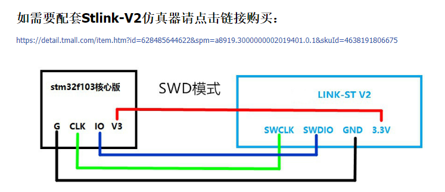 |

### 使用 ST-Link 调试，下载程序

使用 ST-Link/V2 需要下载它的驱动

- https://blog.csdn.net/weixin_50669559/article/details/121437154
- 我的百度网盘上也有这个驱动

参考网址：

- https://blog.csdn.net/weixin_45456099/article/details/107544665
- https://blog.csdn.net/lj9010/article/details/51861605
- https://blog.csdn.net/baidu_24694009/article/details/100779332
- https://blog.csdn.net/qq_42731705/article/details/117092590

|                                   |                                                      |
| --------------------------------- | ---------------------------------------------------- |
| JTAG 和 SWD 对应 ST-Link 硬件接口 | 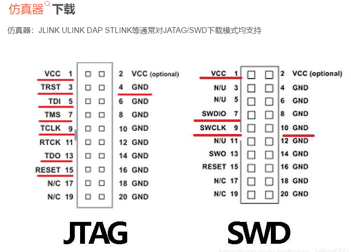 |
| SWD 只需要连接 4 条线             | 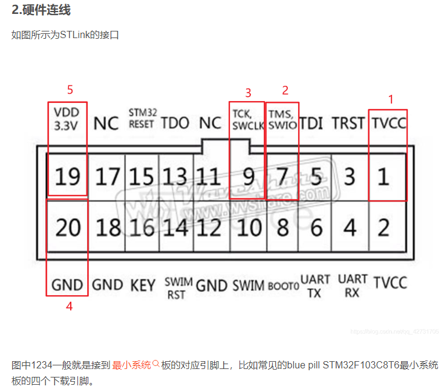 |
| ST-Link 连接实物图                |       |

注意：使用 ST-Link/V2 必须接外部电源，为 MCU 供电

- TVCC: 是 ST-Link 的第 1 脚；用于检测 STM32 有没有电压，不能为下载供电
- SWDIO(SWIO): 是 ST-Link 的第 7 脚，传输串行数据
- SWCLK: 是 ST-Link 的第 9 脚，提供串行传输时钟
- GND: 是 ST-Link 的第 20 脚，任何一个 GND 都可以

Kile5-MDK 的调试，下载魔术棒配置

- https://blog.csdn.net/dorlolo/article/details/109183470

|                       |                                              |
| --------------------- | -------------------------------------------- |
| 选择芯片              | 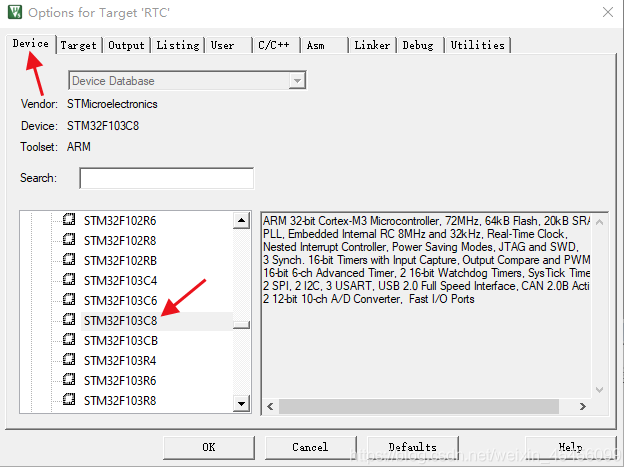 |
| 配置 Debug            | 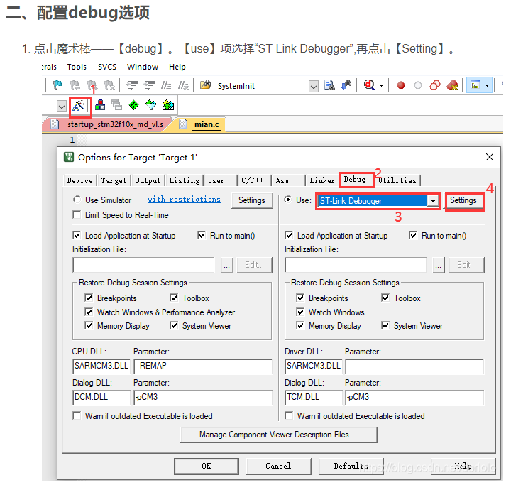 |
| 配置 Debug - Settings | 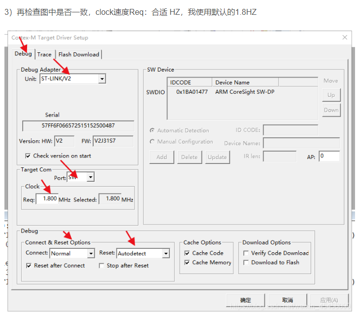 |
| 配置 Debug - Settings | 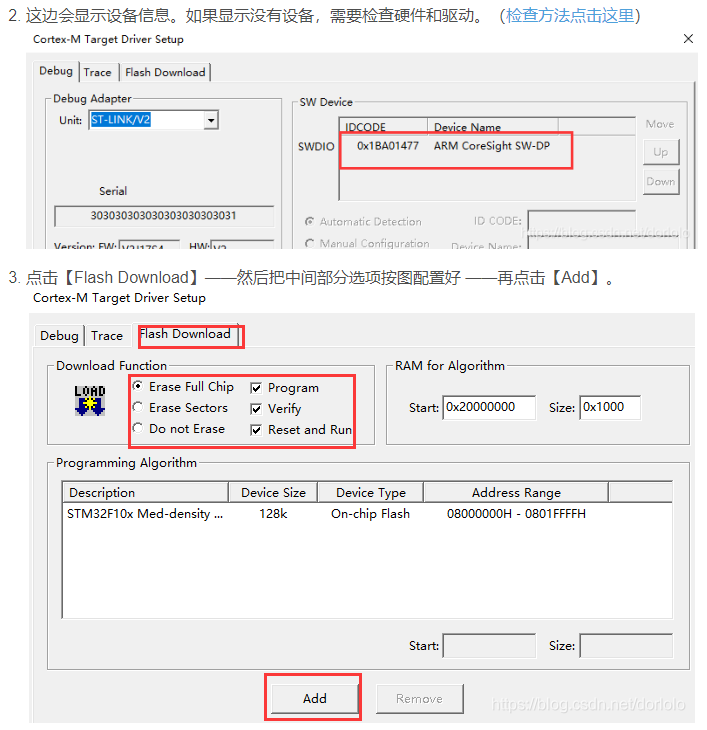 |

- 使用 ST-Link/V2 调试了很久总是提示错误
- 总结两个坑
  - 第一：硬件损害，ST-Link/V2 无法烧录；调试了很久发现不行
  - ST-Link/V2-ISOL 可以烧录下载，但是需要外接电源
  - 第二：可能芯片锁住了需要擦除一下，应该使用 ST-Link Utility 工具
  - 第三：在调试过程中修改了 RAM for Algorithm， 所以一直提示 Algorithm 不对
- 总之还是要多动手尝试

### 使用普中 CMSIS-DAP 仿真器 调试，下载程序

这个调试比较容易

- SWD 的 4 条线对应连接
- Debug 选择 CMSIS-DAP，可以参考普中的开发攻略手册

## 使用 ST-Link Utility 对STM32 进行擦除，下载等操作

参考网址：

- https://zhuanlan.zhihu.com/p/448660584

- 下载 ST-Link Utility 网盘现在也有
- 安装，正常安装就行了；如果出现找不到 mdk140.dll 的情况，就可以卸掉，重新安装一个
- 先 Target - Connect - 连接正常
- 再下载 - 选择 .hex 文件 - start

注意：如果芯片下载不进去可以尝试，先擦除一下，再不行就要修改一下选项字节

- https://blog.csdn.net/qzf1603/article/details/120160143
- https://blog.csdn.net/weixin_43739167/article/details/106680146
