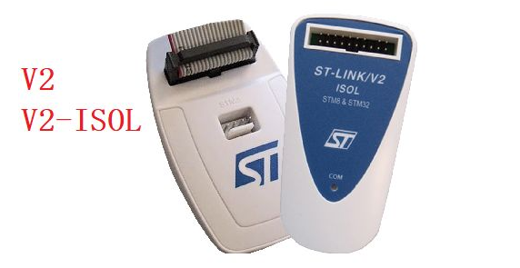

## 如何下载程序到 STM32F103C8

- 使用串口 FlyMcu
- 使用 ISP(PZ-ISP)
- 使用 SWD 下载程序
- 使用 ST-Link
- 使用普中 STM32 仿真，CMSIS-DAP

## ST-Link, J-Link, U-Link; SWD, JTAG, SWIM 以及串口之间的联系与区别

参考网址：

- https://blog.csdn.net/m0_46170433/article/details/105883593

### 串口

- 串口有多种：
  - 异步串口 UART; UART包含TTL电平的串口和RS232电平的串口
  - 一般UART通常是指TTL电平的串口
  - UART，RS232，RS485 都是串口，但是电器标准及协议不同

- TTL电平和RS-232电平
  - Uart，使用的是TTL电平，定义-3.3V-0为低电平-L(0)，而0~+3.3V为高电平-H(1)
  - 一般PC端用的串口是RS232串口，RS232是负逻辑电平，它定义+5 -+12V为低电平-L(0)，而-12~-5V为高电平-H(1)
  - 由于 Uart 和 RS232 的电平逻辑不同，所以，需要中间转换的芯片，CH340G，MAX232
  - CH340G，USB 转 TTL 串口，需要 CH340 驱动，虚拟出 COM 口
  - SP3232，RS232 转 TTL 型，专为 RS232 标准串口设计

- RS232 和 RS485 区别
  - RS232 是点对点的通信，只有一对收发，适合本地设备之间短距离通信
  - RS-485 是多点双向通信，只能有一个主机（master），其他为从机，最多可连接32个设备，最大传输距离是1219米，传输速率为 10Mb/s

### 芯片烧录方式

- ISP 下载
  - ISP 原因：芯片厂商会在MCU内部封装 ISP 功能，为了更方便的下载程序节约成本
  - ISP 是什么：在线系统编程，可以把 code 烧录/下载到MCU上
  - ISP 下载：需要 ISP 上位机软件（PZ-ISP），USB 转 TTL 连接电脑和 MCU
  - 优点：方便，成本低
  - 缺点：不能在线调试，只能烧录/下载

- 串口下载
  - 串口下载原因：MCU 厂商会预留一段启动程序，这段启动程序就是 ISP 引导程序，具有这段启动程序才能使用串口下载程序
  - MCU 上电会根据启动程序判断是使用串口下载，或是 ISP 下载
  - 串口下载：需要 串口上位机（FlyMcu），USB 转 TTL 连接电脑和 MCU
  - 串口和ISP的优缺点差不多
  - STM8 和 C51：单片机上电先运行 ISP 引导程序，如果没有监测 ISP上位机，则运行内部Flash 之前的下载的程序；如果有 ISP上位机，则下载程序；
  - STM32 根据 Boot0 和 Boot1 启动引脚的设置，MCU从不同的位置启动；

SWIM，JTAG，SWD 是 ARM 板上的调试模式：

- JTAG 协议
  - JTAG 是一种国际标准测试协议，重要用于芯片测试
  - JTAG 接口有4线：TMS，TCK，TDI，TDO
  - DSP 和 FPGA 等高级器件都支持 JTAG 协议

- SWD 串行调试
  - 也是一种调试协议，但不同于 JTAG
  - 2 条线，可靠性高，占用引脚少

- SWIM 主要是用在 STM8 在线调试模式
  - STM8 开发：使用 STVD（IDE开发环境） 和 STVP（烧录工具）

ST-Link，J-Link，U-Link 是硬件设备，是一种实际调试工具

- J-Link：就是一个 JTAG 协议转换盒，PC 用 USB 连接J-Link，J-Link 连接 MCU；
  - 支持 JTAG 协议的芯片，都可以使用 J-Link 来在线调试和下载

- ST-Link-V2 专门针对ST公司的 STM8 和 STM32 系列芯片的仿真器
  - 可以使用接口：SWIM，SWD，JTAG
  - 可以在线调试和下载

## ST-Link 的版本，及其差异

参考网址：

- https://blog.csdn.net/ybhuangfugui/article/details/88266399

|                             |                                                |
| --------------------------- | ---------------------------------------------- |
| ST-LinK                     |  |
| ST-LinK/V2; ST-Link/V2-ISOL |  |
| ST-LinK/V3                  |  |

- ST-LinK: 老产品，目前使用不多
- ST-LinK/V2: ST-Link/V2-ISOL：使用较多
  - ST-LinK/V2：价格便宜，有许多山寨的，使用比较多
  - ST-Link/V2-ISOL：带 1000V 隔离，这一版本价格贵
- ST-LinK/V3：功能更强大

## 使用串口下载 SMT32F103 程序

参考网址:

- https://detail.tmall.com/item.htm?_u=i1qhgis7fb7e&id=626358704662
- https://www.cnblogs.com/leo0621/p/8478832.html
- https://blog.csdn.net/weixin_44226857/article/details/106303337

- 硬件: 芯片 CH340G 是 USB 转 TTL 模块, 也是 RS232 转串口;
  - CH340 配合上位机可以下载程序
  - 也可以当成 USART1 和串口助手通信
- 软件: FlyMcu 或 PZ-ISP(普中烧录软件)

|                           |                                       |
| ------------------------- | ------------------------------------- |
| CH340G 原理图(普中)       |        |
| CH340G 原理图(网上)       |  |
| CH340G 和 STM32F03 连接图 |       |
| Boot1 和 Boot0            |          |
| PZ-ISP 下载成功           |      |
| FlyMCU 下载成功           |      |

- 注意:
  - DTR 和 RST 的高低选择需要根据原理图选择

## 使用 SWD 下载程序