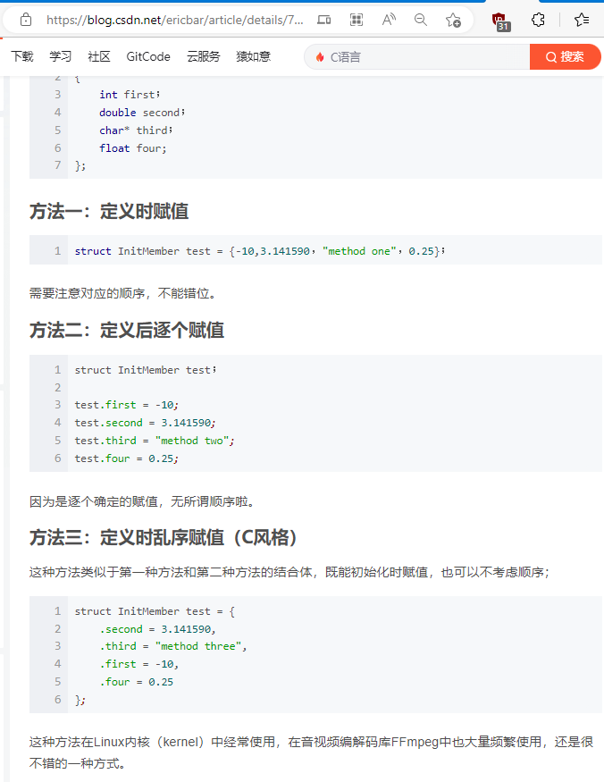

# C 语言深入学习

- [C 语言深入学习](#c-语言深入学习)
  - [结构体](#结构体)
  - [static 和 const 和 extern 和 volatile](#static-和-const-和-extern-和-volatile)

## 结构体

C语言结构体初始化的四种方法

参考网址：https://blog.csdn.net/ericbar/article/details/79567108

## static 和 const 和 extern 和 volatile

- static 静态变量，存储在 RAM 中，值不会改变，别的地方访问
- const 只读，常量，不能再次赋值
- extern 声明全局变量，在 c 文件中定义，h 文件中使用 extern 声明，别的地方可以访问
- volatile 编译器不会对变量优化，从内存中读取
  - 使用情况：
  - 1、中断中的变量
  - 2、各任务间的共享标志，系统状态
  - 3、硬件寄存器

联合使用

- static const int arr = 0； 定义一个 只读的全局静态常量，可以在头文件中定义
- static int arr[3] = {0,1,2};  定义一个全局的数组
  - 可以放到 c 文件中：表示在本文件有效
  - 可以放到 h 文件中：表示全局变量
