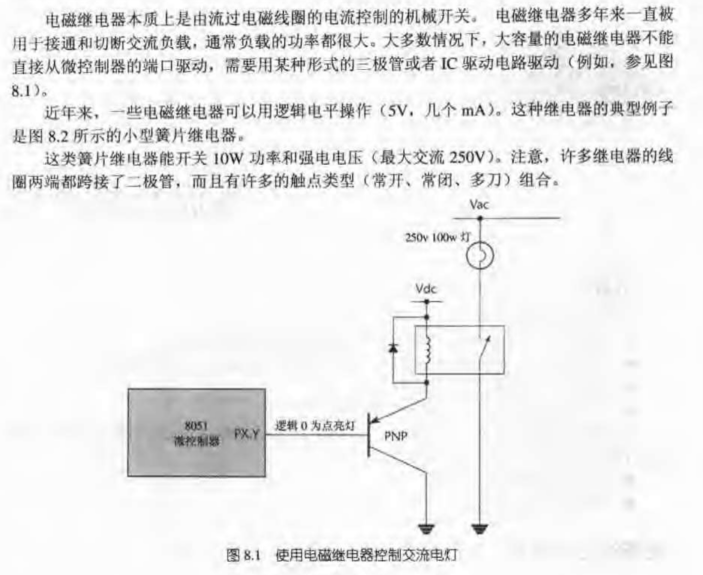

# 时间触发嵌入式系统设计模式

- [时间触发嵌入式系统设计模式](#时间触发嵌入式系统设计模式)
  - [硬件基础](#硬件基础)
    - [实时系统和非实时系统  P6（实时系统）](#实时系统和非实时系统--p6实时系统)
    - [软件设计  P15](#软件设计--p15)
    - [阻容复位  P56](#阻容复位--p56)
    - [直接寻址和间接寻址  P67](#直接寻址和间接寻址--p67)
    - [DATA、BDATA、IDATA  P70](#databdataidata--p70)
    - [单片机驱动一个LED灯的电阻选择  P90](#单片机驱动一个led灯的电阻选择--p90)
    - [BJT 晶体管 NPN、PNP  P101](#bjt-晶体管-npnpnp--p101)
      - [PNP驱动方式 P102](#pnp驱动方式-p102)
      - [保护三极管免受冲击  P106](#保护三极管免受冲击--p106)
      - [MOS 管  P113](#mos-管--p113)
        - [MOS 管直流电机驱动 P117](#mos-管直流电机驱动-p117)
    - [电磁继电器  P122](#电磁继电器--p122)
      - [EMI 电磁干扰  P123](#emi-电磁干扰--p123)
  - [软件基础](#软件基础)
    - [使用端口](#使用端口)
      - [项目头文件的例子  P139](#项目头文件的例子--p139)
      - [读写位  P149](#读写位--p149)
      - [端口头文件  P151](#端口头文件--p151)
      - [功能 C 文件  P165](#功能-c-文件--p165)
    - [延迟  P158](#延迟--p158)
      - [硬件延时适合 ms 级别的，软件延时适合 us 级别的  P158](#硬件延时适合-ms-级别的软件延时适合-us-级别的--p158)
  - [单处理器系统的时间触发结构  P187](#单处理器系统的时间触发结构--p187)
    - [调度器的介绍  P187](#调度器的介绍--p187)
      - [许多嵌入式系统执行的任务，可以分为两种  P190](#许多嵌入式系统执行的任务可以分为两种--p190)
      - [如何在一个 C 文件中调用内部函数写法  P194](#如何在一个-c-文件中调用内部函数写法--p194)
      - [什么是调度器  P198](#什么是调度器--p198)
      - [调度器性能比较  P199](#调度器性能比较--p199)
      - [合作式调度器 - 函数指针的演示  P207](#合作式调度器---函数指针的演示--p207)
      - [调度器数据结构以及任务队列  P211](#调度器数据结构以及任务队列--p211)
      - [合作调度器 “每个微控制器一个中断”的原则  P213](#合作调度器-每个微控制器一个中断的原则--p213)
      - [调度器的一些函数  P214](#调度器的一些函数--p214)
      - [调度应用程序，重要特性是支持低功耗运行  P220](#调度应用程序重要特性是支持低功耗运行--p220)
      - [错误报告  P220](#错误报告--p220)
      - [处理任务重叠  P225](#处理任务重叠--p225)
      - [如何确保调度器可预测，可靠的准则  P226](#如何确保调度器可预测可靠的准则--p226)
      - [合作式调度器的缺点  P227](#合作式调度器的缺点--p227)
      - [合作式调度器内核程序库  P228](#合作式调度器内核程序库--p228)
      - [循环超时和应将超时  P249](#循环超时和应将超时--p249)
      - [面向任务的设计  P255](#面向任务的设计--p255)
        - [多级任务例子  P257](#多级任务例子--p257)
        - [多状态任务  P261](#多状态任务--p261)
    - [混合式调度器  P268](#混合式调度器--p268)
  - [用户界面 Part 4;  P288](#用户界面-part-4--p288)
    - [RS-232 通信  Chapter 18  P290](#rs-232-通信--chapter-18--p290)
    - [开关接口  Chapter 19  P318](#开关接口--chapter-19--p318)
    - [键盘接口  Chapter 20  P344](#键盘接口--chapter-20--p344)
    - [多路复用 LED 显示  Chapter 21  P356](#多路复用-led-显示--chapter-21--p356)
    - [控制 LCD 显示面板  Chapter 22  P368](#控制-lcd-显示面板--chapter-22--p368)
  - [使用串行外围模块 Part 5;  P389](#使用串行外围模块-part-5--p389)
    - [使用 I2C 外围模块  Chapter 23  P390](#使用-i2c-外围模块--chapter-23--p390)
    - [使用 SPI 外围模块  Chapter 24  P410](#使用-spi-外围模块--chapter-24--p410)
  - [多处理器系统的时间触发体系结构 Part 6;  P4224](#多处理器系统的时间触发体系结构-part-6--p4224)
    - [共享时钟调度器的介绍  Chapter 25  P425](#共享时钟调度器的介绍--chapter-25--p425)
    - [使用外部中断的共享时钟调度器  Chapter 26  P438](#使用外部中断的共享时钟调度器--chapter-26--p438)
    - [使用 UART(通用异步收发器)的共享时钟调度器  Chapter 27  P480](#使用-uart通用异步收发器的共享时钟调度器--chapter-27--p480)
    - [使用 CAN 的共享时钟调度器  Chapter 28  P533](#使用-can-的共享时钟调度器--chapter-28--p533)
    - [多处理器系统的设计  Chapter 29  P558](#多处理器系统的设计--chapter-29--p558)
  - [监视与控制组件 Part 7;  P569](#监视与控制组件-part-7--p569)
    - [脉冲频率检测  Chapter 30  P570](#脉冲频率检测--chapter-30--p570)
    - [脉冲频率调制  Chapter 31  P581](#脉冲频率调制--chapter-31--p581)
    - [模数转换器（ADC）的应用  Chapter 32  P592](#模数转换器adc的应用--chapter-32--p592)
    - [脉冲宽度调制  Chapter 33  P630](#脉冲宽度调制--chapter-33--p630)
    - [数模转换器的应用（DAC）  Chapter 34  P654](#数模转换器的应用dac--chapter-34--p654)
    - [进行控制（PID）  Chapter 35  P670](#进行控制pid--chapter-35--p670)

## 硬件基础

### 实时系统和非实时系统  P6（实时系统）

> 实时系统： 必须在某个固定时间（4ms，6ms）内执行，并完成某个任务； 比如，飞机，导弹引爆等
> 非实时系统： 手机，电脑，可以快一点，但慢一点也行的

### 软件设计  P15

> 数据流图
> 状态转移图

### 阻容复位  P56

|                                                   |                                                        |
| ------------------------------------------------- | ------------------------------------------------------ |
|  |  |
|     |        |

- 10uF + 100k, 复位时间是 100ms
- 10uF + 10k, 复位时间是 83ms

### 直接寻址和间接寻址  P67


### DATA、BDATA、IDATA  P70

- 将程序存储在 ROM 中： int code a[256] = {0x0000, 0x0001, 0x0002 ...}
- 使用 DATA 区: char data a;
- 使用 BDATA 区: char idata b;
- 使用 IDATA 区: char bdata c;

### 单片机驱动一个LED灯的电阻选择  P90

- MCU 一般只能用来控制，所有电器消耗的电能均需要来自 VCC


### BJT 晶体管 NPN、PNP  P101

- NPN 是基极提供电流
- PNP 是基极吸收电流
- hfe 是三级管的放大倍数


#### PNP驱动方式 P102

- PNP 驱动方式：b = 0; 有电流流出，三极管导通；b = 1；没有电流流出，三极管截止

|                                              |                                              |
| -------------------------------------------- | -------------------------------------------- |
|  |  |

#### 保护三极管免受冲击  P106


#### MOS 管  P113

- 三极管是双极型晶体管，有两个PN节，是电流控制开关
- MOS管是半导体场效应管，是电压控制开关，开关频率很快，常用在PWM控制中，对静电非常敏感


##### MOS 管直流电机驱动 P117


### 电磁继电器  P122



#### EMI 电磁干扰  P123

- 过零检测


## 软件基础

### 使用端口

#### 项目头文件的例子  P139

- 以后编程需要养成某种编程风格，可以参考：
- main.h


#### 读写位  P149

- 位的读写，可以参考
- 现在对位的读写，使用的宏定义的方式，比使用函数更优

|                                             |                                             |
| ------------------------------------------- | ------------------------------------------- |
|  |  |

#### 端口头文件  P151

- 端口头文件： 用来定义端口和端口初始化
- Port.h


#### 功能 C 文件  P165

- .c 文件的格式，可以参考


### 延迟  P158

#### 硬件延时适合 ms 级别的，软件延时适合 us 级别的  P158


## 单处理器系统的时间触发结构  P187

### 调度器的介绍  P187

#### 许多嵌入式系统执行的任务，可以分为两种  P190

- 周期性任务， 比方说：每 100ms 执行一次
- 单次任务， 比方说：在 50ms 的延迟之后执行一次


#### 如何在一个 C 文件中调用内部函数写法  P194


#### 什么是调度器  P198

- Scheduler 调度器
- 调度器可以看作一个简单的操作系统


#### 调度器性能比较  P199

- 合作式调度： 单任务系统结构，简单，可靠，代码量少，不是独立系统，是开发的一部分
- 抢占式调度： 多任务系统结构，复杂，响应快，不可预测，单独作为一个独立系统，
- 混合式调度： 支持有限个（1个）抢占式任务，可靠，不是独立系统，是开发的一部分
- 总结： 大多数的嵌入式开发系统，都可以使用合作式调度

#### 合作式调度器 - 函数指针的演示  P207

- 使用 STM32F1 或 STM32F4 练习

TODO: 理解函数指针 和 函数如何传参数以及回传

使用 STM32F103C8 芯片练习函数指针

- 函数指针在桌面应用很少用到，但却是创建调度器的关键

#### 调度器数据结构以及任务队列  P211

- 理解结构体，和队列

TODO: 复制出来合作调度器的相关结构体等

使用 STM32F103C8 芯片练习函数指针

- 调度器的核心是调度器数据结构；是用户自定义的数据类型
- 初始化；设定 “时标” 1ms

#### 合作调度器 “每个微控制器一个中断”的原则  P213

- TODO: 只能用一个中断，那其他中断怎么办？

后面应该会有提示，不可能只能用一个中断

#### 调度器的一些函数  P214

TODO: 需要用 stm32 运行的

- “刷新”函数
- “添加任务”函数
- “调度”程序函数
- “开始”函数
- “删除任务”函数
- “睡眠”函数
- “错误报告”函数
- “看门狗”

#### 调度应用程序，重要特性是支持低功耗运行  P220

#### 错误报告  P220

- 记录系统中的错误，以 LED 或者更加友好的 LCD 界面显示出来，用来通知用户发现错误

#### 处理任务重叠  P225

- 合理使用任务初始延迟
- 大多数情况下，1ms 的时标是通用的
- 如果想把开销和功耗降低，可以加长调度器时标
- 多个任务，使用 ”最大公因数“ 作为时标

#### 如何确保调度器可预测，可靠的准则  P226

- 时标间隔 = 最大公因数
- 所有任务运行时间都应小于调度时标间隔。往往用软件模拟测量任务运行时间
- 所有任务设置“超时”，使他们不会阻塞调度器；printf 就没有超时特性
- 减少任务重叠，合理使用任务初始延时；如果任务短，不会超时，或可以容忍任务抖动，可以不关心任务重叠

#### 合作式调度器的缺点  P227

- 如何保证快速响应外部事件
- 任务使用多个中断不安全，只能有一个定时中断，其他中断怎么处理？

#### 合作式调度器内核程序库  P228

- 需要抄出来运行一下
- 参考网址：https://blog.csdn.net/wowocpp/article/details/82887244

#### 循环超时和应将超时  P249

合作式调度器，关键要求是，对于所有任务，必须在设定时标间隔内完成，Duration(task) < 时标间隔

- 如果任务不能在规定时间内完成，就中止该任务，所以，引入超时模式：
  - 循环超时就是一个 while 循环判断时间；
  - 硬件超时就是配置一个硬件定时器，计数更准确

循环超时：

```
while((_I2C_SCL == 0) && (++Timeout_loop))
{
  ;
}
if(!Timeout_loop)
{
  return 1; // 错误，超时
}
```

硬件超时：

在 STM32 中可以使用 SysTick 定时器，精准定义超时

#### 面向任务的设计  P255

使用合作式调度器，两个主要设计特性：

- 多级任务： 将长任务转换为短任务
- 多状态任务： 将多个任务替换为一个任务，根据系统的当前状态执行不同的操作


##### 多级任务例子  P257

- 使用UART每隔5s发送43个字符的长任务分割


- 使用定时器外部计数，进行脉冲计数，测量转轴转速
  - 100ms 读取一次定时器计数，存在全局变量中，定时器计数清零，重复


- LCD 刷新显示
  - 多级 LCD 库，在第22章 LCD 字符面板中给出

##### 多状态任务  P261

在一个系统中，往往有许多任务，是单次任务，或被调度任务，这种任务，不能作为系统某个状态被合作式调度器调度

- 这个时候，就需要“系统刷新”任务，即状态机，即多状态任务
- 洗衣机系统中，系统刷新任务

多级任务，单任务调度器，一年调度器，使用极少CPU，存储器，却是是非常简单有效的系统结构

- 多状态任务实现交通灯控制系统  P266

使用调度器，每秒调度一次“刷新任务”，刷新任务使用状态机完成

- 这里使用调度器，确实比使用 4ms 时间片轮询更独立，与其他任务之间关联更少

### 混合式调度器  P268

合作式调度器硬性要求，所有任务必须在时标之内完成，这是它的局限性

很多情况，即要运行长任务（例如1000ms运行100ms时间），同时又要运行频繁的短任务，在合作式调度器中，这两个任务会有冲突

提供相对解决方案，缩短运行使时间

- 使用更快的处理器
- 使用更快的振荡器
- 混合式调度器，综合抢占式调度器和合作式调度器的特性，且是受控的，


混合式调度器：有两个任务平面；一个在中断中的抢占式调度器，一个在 while 循环中的合作式调度器；

- 参考网址：https://blog.csdn.net/wowocpp/article/details/82998576
- 使用混合式调度器的关键式保证任务不重叠，合理使用 delay
- 抢占式任务的运行时间尽可能的短，最长不能大于时间间隔的 50% 否则会消弱系统的总体性能
  - 由于抢占式的任务会重叠到合作式的长任务的时标间隔，所以，推荐使用一个抢占式任务
  - 抢占式任务常用来做检查错误，或紧急事件
  - 可以在合作式调度器中运行长任务，抢占式运行短任务
- 抢占式任务和合作式任务，同时访问关键代码段；
  - 一种简单的锁定机制；资源被锁则返回，不做任何操作；

## 用户界面 Part 4;  P288

### RS-232 通信  Chapter 18  P290

- 串行通信
  - 单工：数据只能有一个方向传输；至少需要两根线（信号线 和 地线）
  - 半双工：同一时刻只能有一个方向传输；至少需要两根线
  - 双工：两个方向传输；至少需要三根线（信号线A，信号线B，和地线）
- RS-232：点到点的通信，只能连接两个芯片；不做远距离传输
  - RS-485：多点通信，只有一个主机，其他为从机；
- RS-232 是一种面向字符的协议；即，规定为发送一个一个的 8 位数据块；通常用如下方式对信息进行编码
  - 发送一个 “起始” 位
  - 发送数据 8 位
  - 发送一个（或多个）“停止” 位
- RS-232 状态
  - 静态：“发送” 线上无数据时；这根线保持逻辑 1 电平
  - 起始位：将 “发送” 线拉低，指示数据传输的起始
  - 数据为：ASCII 码格式；可以 8 位全是数据位；也可以7位数据位，1位奇偶校验位；先发送最低位；
  - 停止位：输出逻辑 1，可以是 1 个，或少见的 1.5 或 2 个脉冲宽度
  - 就是 UART 的 8N1 传输方式；8N1：1起始位+8数据位+1停止位共10次电平变化；
- RS-232 是异步数据传输
  - 异步数据传输：指时钟信号不随数据发送，通信链路的两端有运行在同样频率的内部时钟；
    - 如果有必要，可以同步该时钟，以保证成功的传送数据
    - USART：异步数据传输，需要相同的波特率
    - I2C，SPI：同步数据传输，需要一条时钟线
  - 典型的波特率：75，110，300，1200，2400，4800，9600....; 最常用的是 9600
- RS-232 电平
  - 接收器的阈值：+3V 和 -3V，极限电压是 +15V 和 -15V
  - MCU 无法输出这种电平，需要 TTL 转 RS-232 用 SP3232 芯片转，同时需要 PC 有 9 头的串口接口，支持串口 RS232 协议才行
  - 另一种：CH340G，USB 转 TTL 串口，需要 CH340 驱动，虚拟出 COM 口；直接接 PC 的 USB 更方便
- 流量控制：如果接收器内存已满，无法接收，应该通知发送器暂停数据流；比如：PC的 RAM 缓冲区满了
  - 可以从硬件或者软件着手，常用的方式是 “Xon/Xoff 控制”，这需要半双工或全双工通信连接
  - 运行如下：
  - 1、发送器发送一个字节的数据
  - 2、如果接收器能够接收更多的数据，它将不做控制
  - 3、接收器发送另一个字节的数据
  - 4、继续 1-3，直到接收器不能接收更多的数据；然后它发送一个“Control s”（Xoff）字符到发送器
  - 5、发送器接收“Xoff” 命令并暂停数据传输
  - 6、当接收器节点可以接收更多的数据时，它将发送一个“Control q”(Xon) 字符到发送器
  - 7、发送器继续数据传输
  - 8、继续步骤1 的过程

这一节中将实现嵌入式微控制器到PC的 RS-232 连接

- 串口的 TX 和 RX 应该交叉连接
- 使用 9600 波特率，即，9600 bits/s; 加上起始，停止位，一共 10 个位；1/9600 = 0.0001s；10 个位就是大约 1ms，传输一个字节
- 如果传输一段话有 42 个字节，那需要42ms，时间太长
  - 解决方法：将所有数据存入一个缓冲区，定期调度一个任务，发送缓冲区的数据，通常一次发送一个字节
  - 这种结构：多级任务

串口数据的波特率

- 1、使用片内 USART 进行 RS-232 通信，查看芯片手册
- 2、使用定时器产生波特率；
- 波特率不一定是准确的，比如 9600 的波特率，实际波特率是 10417，误差在 8.5%
  - 因为会受晶振和定时器分频的影响，数值可能会偏差
  - 波特率越接近准确值越好，因为是异步通信，所以，温度的变化，晶振的误差，都可能引起波特率的误差
  - 使用晶体振荡器，而不是陶瓷振荡器，因为陶瓷振荡器不稳定，对时钟要求比较高的场合不适用
  - 波特率的误差要在 5% 以内；

波特率不准确，调整方案

- 1、更换晶振，使时钟准确
- 2、使用内部定时器来产生波特率
- 3、更换 MCU，选择带有片内 UART 的芯片
- 4、使用两个 MCU，和一个共享时钟调度器；使用不同的晶振，产生不同的时钟，一个产生时标 1ms，一个产生准确的波特率 9600

不推荐使用标准库函数 printf();

- 标准库函数运行时间太长，合作式调度器中不太安全
- 不包括超时，可能会挂起程序
- 使用另外的中断，和长时间的程序，都不能使用在合作式调度器

### 开关接口  Chapter 19  P318

- 普通按键开关：小电流，低电压，使用寿命长
- 常开（NO），常闭（NC）开关
- 多状态开关，根据按键时间长短判断功能
- 软件消抖：10ms - 20ms

### 键盘接口  Chapter 20  P344

- 键盘两种方法
  - 1、每个按键，单独使用一个引脚
  - 2、扫描按键，使用 R（行） * C（列）个引脚
- 扫描按键核心，是扫描
- 其中还有一个 功能键 的实现 “*”，“#”
- 缓冲区设置


安全的按键扫描方法，使用 共享时钟调度器在 第6篇 中介绍；

### 多路复用 LED 显示  Chapter 21  P356

- 就是共阳或共阴极的 7 段数码管，加小数点就是 8 段；
- 相当于每一段是一个 LED 灯
- 注意：数码管的 8 个 LED 灯，不能直接用 IO 口驱动
  - 因为：每个段的驱动电流最小：2mA 最大：60mA 甚至 100mA
  - 直接使用 IO 口，无法可靠的提供所需的电流
  - 一般的数码管每段的驱动电流是 9mA，一个数字大约是 80mA 的电流
- 所以，要使用 LED 数码管的时候应该在 IO 引脚和 LED 数码管控制脚中间加一个缓冲器，即 IC 驱动芯片
  - 这种 IC 驱动芯片：74*240；UDN2585A;
  - 这种 IC 的每个通道都可以提供高达 120mA 的电流（最高 25V）

如果使用多个数字，比如：四个数码管，应该使用多路复用的方式，循环点亮每个数码管

- 每个显示只驱动 1/4 的时间，频率在 20-50HZ 之间循环显示
- 8 个数据线，4 根片选线，一共12 根线
- 注意：数码管的输入和输出都连接到 IO 口上，注意灌电流不能太大
  - 输入 IO 口的电流是 灌电流
  - 输出 IO 口的电流是 拉电流
  - 所以，为了避免损害 MCU 应该在片选线上也使用缓冲芯，避免灌电流
  - 即，MCU 只能做控制，不能做驱动，应该避免直接驱动
- 这里是 1/4 扫描点亮，所以，如果要获得高亮度，应该在 1/4 时间里使用正常电流的四倍；通过提高电流，提升亮度
- 如果直接 MCU 提供大电流，将极大地降低 MCU 使用寿命


注意：对于驱动 LED 数码管，可以使用 NPN 型晶体管替换缓冲器 IC，但是其性价比不高，价格不一定比使用 IC 更便宜。

### 控制 LCD 显示面板  Chapter 22  P368

LCD 和 LED 的不同点：

- LED 是发出光线，通过电流大
- LCD 基于无源显示技术，不发出光线，控制光线的通道
  - LCD 的功耗很低，大的 5V 面板需要电流最高 5mA，功率 25mW
  - 所以，使用电池的低功耗场合，使用 LCD 更节能

LCD 大体有两种：图形显示 和 文本显示；
桌面 PC 使用的是像素显示，价格昂贵，需要较大的处理器和内存，不适合嵌入式设备；

- LCD 显示屏通常内部集成了控制器，使用只是通信控制
  - LCD 每个字符有点阵组成，通常是 5 * 8 或 5 * 11 个点阵组成
  - HD44780，LCD1602 是 LCD 显示面板

这个例子，没有 HD44780 这个 LCD 显示屏；

看源代码的总结：

有很多新的思路，新的代码写法

- 封装成库，以后直接使用，函数分的很小块，但是 call 太多，消耗堆栈
  - 小型 MCU 需要注意堆栈的层
- 驱动一个模块，一般只有两个主调函数
  - LCD_Init() 和 LCD_Update()
  - 在调度器中调度 Update 函数
  - 数据的传递，是通过 Buffer，或者 指针
- Init 函数里面，先做什么再做什么很清晰，完全按照人的逻辑运行
  - 所有与硬件控制的，都被封装成一个函数，被调用
- 关于代码的写法，思路
  - 二维数组的使用；char LCD_data_G[LCD_LINES][LCD_CHARACTERS+1]= {"aaaa","bbbb"}；
    - 数组下标可以用宏定义
  - 指针存储字符：char* pTime =  "Elapsed :-      ";
    - 传递的指针相当于数组名，使用方法是 pTime[x];
  - 不可变数组可以存放在 ROM 中，节省 RAM 空间
  - 宏定义的频繁使用，顾名思义，阅读方便
    - 用户配置参数，定义为宏定义
    - 控制命令，计时，等都可以为宏定义
- 运行时间的计时，使用二维数组更新显示

## 使用串行外围模块 Part 5;  P389

### 使用 I2C 外围模块  Chapter 23  P390

I2C 的特点

- 2 线式串行通信总线，由 Philips 公司研制
- I2C 可以用在 LCD,LED 显示，EEPROM，数模转换器芯片等很多外围设备上
- I2C 总线，可以连接多达 20 个设备
- I2C 协议简单，可以使用同一组软件代码
- I2C 速度也够快，如果使用 1ms 调度器时标，数据传输速率高达 1000字节/秒

I2C 总线的连接


- 总线芯片个数受限于 480pF 的负载电容，默认一个外围设备和它的连线总电容是 20pF
  - 所以，可以连接 20 个设备
- 电阻的选取根据公式： R = 50 / d
  - R: 上拉电阻的选取值（KΩ）
  - d： 总线上芯片数量
  - 当只有一个设备的时候，使用上拉电阻 50k
- SCL 和 SDA 使用开漏输出 IO 口

I2C 的通信

- 设备地址：
  - I2C 的通信是基于地址的，每个芯片都有自己的地址，可以根据地址与具体芯片通信
  - 芯片地址可以有 7 位或 10 位
  - AT24C64 是 EEPROM 芯片，地址前4位固定，后 3 位根据引脚确定
    - 地址：“1 0 1 0 A2 A1 A0”
  - 大多数 I2C 设备地址都是这样
- 主机和从机：
  - I2C 的时钟信号始终由主机产生
    - 不管是读或是写，都是主机的时钟控制
  - I2C 可以有多主机，同一时间只能有一个主机，其他设备都为从机
    - 这里的主机，不是每个芯片都是主机，某些设备只做从机
- 数据传输：
  - 注意：每一个数据位一个时钟脉冲，当SCL为高的时候，SDA线的数据必须稳定，当SCL为低的时候，SDA线的数据才能被改变
    - 就是SCL低的时候放数据，高的时候采集数据，所以，必须稳定
  - Start：当 SCL 为高，SDA 由高到低跳变，由主机产生
  - Stop：当 SCL 为高，SDA 由低到高跳变，由主机产生
  - 先传输最高位，每次必须传输 8 位，字节数不受限制，但是必须回传 ACK
  - ACK：主机产生时钟信号SCL，同时拉高SDA，从机拉低 SDA 为ACK
  - NACK：主机产生时钟信号SCL，同时拉高SDA，从机拉高 SDA 为NACK


应用

- I2C 通常应用于 单主机多从机的网络，也可以使用多主机网络
- 执行速度：
  - 标准：100kB/s;  快速：400kB/s;  高速：3.4MB/s
  - 多数用于低速系统
- 开销：
  - RS-232 是硬件支持，数据在后台发送与接收
  - I2C 全部由软件实现；这无疑将增加 CPU 开销，使用多级任务
  - 需要计算总运行时间：0.5ms
- 缺点：
  - I2C 很少检错机制，需要的话可以添加，对数据检错
  - 迅速检测电缆线路的损坏；
- 如果可能：尽量选择微控制片内功能，避免使用外围模块，或升级 MCU

代码总结：

- I2C 的代码，没有用到调度器，只是一个 I2C 的内核软件例子；
  - 这种例程，普中开发教程上也有，固件库也要
- 代码错误抛出，这是一个很好的习惯

### 使用 SPI 外围模块  Chapter 24  P410

SPI 特点

- SPI 是 Motorola 开发
- SPI 是同步时钟，速度比 I2C 快 5000-10000 字节/秒
- SPI 和 UART 一样通常使用硬件支持，而不是像 I2C 一样纯软件构成

SPI 总线的连接

- SPI 是四线结构（MOSI，MISO，SCL，CS 片选）
- SPI 是单主机，多从机的结构，通过片选 CS 选择是与哪个从机通信
- SPI 是主机和从机的移位寄存器连在一起，
  - 主机发送一个字节到从机，同时，一个字节的数据从从机回传到主机

SPI 传输时序

- 四种时序：
  - CPOL = 0； 时钟线空闲状态为低电平
  - CPOL = 1； 时钟线空闲状态为高电平
  - CPHA = 0； 在时钟的第一个跳变沿（上升或下降）数据被采样
  - CPHA = 1； 在时钟的第二个跳变沿（上升或下降）数据被采样

代码总结

- 具体可以参考普中 STM32F1-SPI-Flash 实验，比这里的例程更详细
- 这个例程没有用调度器
- 两大优点：
  - 1、代码错误抛出
  - 2、硬件延时，时间溢出机制，超时报错
- SPI 的读写是同一个函数，只有发送一个数据就会回传一个数据
  - 读：发送 0x00 存储回传的数据
  - 写：直接发送数据，不管回传的数据

## 多处理器系统的时间触发体系结构 Part 6;  P4224

### 共享时钟调度器的介绍  Chapter 25  P425

当嵌入式系统，需要更多外的外设，一个 MCU 不能满足要求，可以考虑使用双微控制器，和多微控制器的设计

- 模块化设计优点：
  - 比如闹钟：把功能分布在两个模块上
    - 第一个实现计时和时间功能调整
    - 第二个实现显示模块控制：LCD，步进电机等
- 智能节点：
  - 可以在模块中封装微控制，记录数据，组成智能节点
  - 即便断路，重组后数据依旧可以保存


使用多个处理器，需要解决的一些问题

- 如何保持各节点的时钟同步
  - 主节点使用定时器中断，从节点时标消息，并不在使用定时器中断
  - 关键这个时标消息怎么来？
- 如何在各节点间传输数据
  - 主节点或者从节点之间，同时支持时标消息和确认消息
  - 时标消息：从主节点发送至从节点
  - 确认消息：从从节点发送至主节点
- 一个节点如何检测其他节点是否发生了错误
  - 从节点只要检测每隔1ms（比方说）接收一个时标消息，然后判断是否超时
  - 主节点就麻烦一点：要判断 N 个从节点的确认消息
    - 每个从节点要包含 ID（标识符）消息内容等
  - 主节点处理错误，从节点处理等...
  - 这里暂时用不到，先不详细讨论了


增加处理器，要小心使用，因为，很容易产生一个不可靠的系统；

### 使用外部中断的共享时钟调度器  Chapter 26  P438

主节点使用定时器时标，“刷新”函数当中控制 IO 口，从节点开启外部中断，连接这个 IO，外部中断函数充当“刷新”函数

注意：使用外部中断传递时标，很容易受到电磁干扰；因此，这种调度器只适用于“本地”网络，微控制之间不超过几厘米的情况，大多数应该在同一块 PCB板上；

- 方案一：使用一条外部中断做时标
  - 从节点可以通过内部看门狗，或定时检测，很容易检测到主节点的故障
  - 主节点无法检测到从节点是否故障
  - 没有主从节点之前的数据传输机制
- 方案二：使用外部中断 + 外部看门狗
  - 主节点也可以检测到从节点故障
- 方案三：主从节点共用晶振，但是各自都有自己的定时器
  - 主从节点之前为松散耦合
- 方案四：方案二的基础上加上数据通信端口，双向数据通信
  - 使用一组端口，即8个端口，比较浪费 IO 口


代码总结：

- 初始化应该检测核心部件是否连接正常，工作正常
  - 比如：多核中的，对从机的检测；或 SPI，I2C 通信部件的检测
  - 如果发生错误，或连接中断，要抛出错误
  - 错误检测机制
- 初始化最后，应该保证系统工作在安全状态，不能是随机状态
- 具体代码案例分析
  - SCI_Ti1: 这个是方案一的源码
  - 核心是：
    - 主机在定时器中断“刷新” 函数中，修改连接从机外部中断的 IO 口；产生下降沿
    - 从机配置外部中断下降沿触发，在外部中断中 “刷新” 从机的调度器
  - SCI_Ti2: 这个是方案二的源码
  - 在 SCI_Ti1 的基础上加了，主节点检测从节点断开的功能：
    - 主节点在 “刷新” 函数中检测从节点外部看门狗的翻转，没有翻转表示断开
    - 中断当中是可以死循环不退出的，维持一个状态，等待复位
  - SCI_Dm: 这个是方案四的源码
  - 在 SCI_Ti2 的基础上加了，主节点与从节点通信的功能：
    - 主节点在 “刷新” 函数中检测从节点外部看门狗的翻转，同时发送数据
    - 从节点在 “外部中断” 函数中刷新，同时处理发送的数据
- 这些代码，包括整本书都是一种思想的启迪，不是具体案例，具体开发还需要详细去做，这里只能说提供一些思路

### 使用 UART(通用异步收发器)的共享时钟调度器  Chapter 27  P480

UART 是一种简单低成本的通信设计，可以通过收发器将信息传递给 PC，数据分析；
UART 适用于本地和分布式网络

- 本地网络：一般包含几个 MCU 彼此之间距离较近（几厘米）在同一块 PCB 板
- 分布式网络：微控制之间距离较远（几米到百米），用 RS-485 网络

本地网络，主节点产生时标，从节点开启 UART 中断，每个时标，主节点发送一个 UART，从节点接收到 UART 中断“刷新”调度器，同时回传消息 UART 给主机

- 连接多个从节点，则 UART 发送需要两个字节：地址字节，数据字节
- UART 发送方式是一次只发送一个字节，先发送地址，在发送数据
- 从节点，确定是自己的地址，则接受数据
- 相当于 I2C 的 ACK 回应消息


- 波特率的问题：
  - 数据位+起始位+停止位 = 10个位；每 1ms 发送两个字节，即 1ms 发送 20 个bit，即波特率至少要 20000
  - 波特率不一定要使用标准波特率，但是标准波特率更利于和 PC 通信
- 延时问题：
  - 由于从节点触发是在 UART 末尾的，所以，从节点的刷新会有一些延时
  - 这个延时是固定不变的，并且是可预算的：20000 波特率的延时是 1/20000 * 10 = 0.5ms
  - 这个延时不会叠加，一般没有太大影响；


- UART：规定数据的传输位，波特率，校验，起始位和终止位
  - UART 是 TTL 电平的，可以直接使用在 MCU 上
  - 但是，UART 是单线的传输，抗干扰能力很差，所以，只能用于本地网络
  - 它本身就是一种协议可以直接使用
- RS-232：国际规定的标准，9针串口，或25针串口
  - 不是 TTL 电平，它逻辑1（-3到-15V）逻辑0（3V-15V），不能在 MCU 上直接使用
  - 所以需要收发器把 TTl 电平转换为 RS232 电平；即 UART + RS232 网络
  - 所以，我们使用 RS232 就相当于使用串口，转换的工作由收发器做
  - RS-232 的抗干扰能力更好，是点对点的短距离本地传输，两个节点数据传输
- RS-485：一种协议标准
  - RS485 逻辑1两线的电压差为 +（2V到6V）；逻辑0两线的电压差为 -（2V到6V）
  - 也不能直接使用在 MCU，需要收发器把 TTL 电平转换为 RS485 电平；即 UART + RS485 网络
  - 使用 RS485 就相当于使用串口，转换的工作由收发器做
  - 速度快，传输距离远，使用双绞线，抗干扰能力强
  - RS485 是一对多的关系，只能有一个主机，其他全为从机
  - 同一时刻，只能有一个收发器在网络上发送


代码总结：

- 重点：主从机的 UART 通信；
- 主机 代码思路：27\Local\SCU_A2\SCU_A2m； 例程是 一个主机两个从机
  - 初始化：SCU_A_MASTER_Init_T1_T2()
    - 方法：使用 const 修饰不可变变量，存储从机地址
    - 使用可变数组承接从机地址，保证数据安全性
  - 开始函数：SCU_A_MASTER_Start()
    - 使系统在一个安全状态
    - 延时 3s，复位所有从机
    - 同步从机：遍历所有从机地址，发送 2 次，间隔 5ms 这也是时标
    - 检查从机数量，是否抛出错误
  - 更新函数：SCU_A_MASTER_Update_T2()
    - 发送格式是：S1-ID, S1-Data, S2-ID, S2-Data; 每次都是一个时标
    - 先检查从机 ACK
    - 收到数据：第一次检查从机 ID，第二次接收数据
    - 再发送时标：按照上面格式，遍历所有从机
- 从机 代码思路：27\Local\SCU_A1\SCU_A1s
  - 开始函数：SCU_A_SLAVE_Start()
    - 使系统在一个安全状态
    - 等待接收：UART 连续两次接收到自己的 ID，握手通过
    - 主机延时 3s 没有时标，看门狗复位，从机会再次等待主机匹配
  - 更新函数：SCU_A_SLAVE_Update()
    - 在 UART 中断中更新
    - 获取主机消息：是本地 ID 则回传 ACK；不是则只刷新任务
    - 回传过程分为两步：第一步是 ID，第二步是 DATA
- 27\Local\SCU_A3 例程是 一个主机，一个从机，一个备份从机
  - 代码和思路是和上面一致的，只是修改了备份从机 ID
- RS485 例程
  - 27\RS-485\SCU_B1\SCU_B1m
  - 27\RS-485\SCU_B1\SCU_B1s
  - 和 local 的主机、从机程序差不多；
  - 区别是 RS485 收发器多了两个 IO 口，控制 RS485 收发器的读写功能；只是多了这个控制功能

### 使用 CAN 的共享时钟调度器  Chapter 28  P533

上一章使用 UART 共享时钟，多处理器调度，可以在本地，也可以在分布式（RS485）多处理机环境中使用。但是，UART 的缺点是，通信能力弱，检错能力弱；

CAN 是基于消息的，发送的数据包，可以连接不同（高速，低速）的系统

- 消息最长 8 个字节，大部分系统都够用
- CAN 集成到片内，简化了开发；当然也有独立的 CAN 控制器芯片
- CAN 有两个标准，高速传输 1MB/s 限 40m；低速传输 5KB/s 限 10Km
- CAN 也是双线差分串行总线，使用的是双绞线，可以抵消噪声，抗干扰能力强
- CAN 电路两头也要接电阻，最大连接数量是 32 个从节点，标识符（0x01 - 0xFF）
- CAN 从节点的标识符，意义不是从节点的地址，而是表示优先级的标号，一个网络上的标识符不应能够相同
- CAN 的通信也是有波特率的； 在开发中，要配置这些参数

CAN 的信号：

- CAN 有显性显示 表示 0，和隐性显示 表示 1；
- 内部一帧的数据，即 8 个字节的数据内容比较复杂，参考 STM32 开发攻略中的内容

总结：在 STM32 中，应用 CAN 总线就是了解一下配置，然后知道一些关键位的作用，再就是产品怎么用

代码总结：

- 程序的思路逻辑和 RS232，RS485 是一样的；只是替换 UART 的接收和发送数据的代码为 CAN 的格式
- CAN 是内嵌入芯片的，所以，需要配置，和了解一些标志位的作用
  - 我没有具体看每个位的作用，用到的时候在看

### 多处理器系统的设计  Chapter 29  P558

- 数据联合：有效的带宽，传输不同类型的数据
  - 例如：UART 中只能传输 8bit，要想传输整型或浮点型怎么做？
  - 使用共同体 union；可以定义多种类型的变量，共享存储空间
  - 但是要注意不同的编译器，可能整型有的占2个字节，有的占4个字节，小学使用


- 长任务：合作式调度器是这本书推荐的方式；缺点是对长任务处理和中断使用的限制
  - 长任务：每1000ms 持续运行 100ms；短任务：每 1ms 运行1次
  - 在多处理器的系统中，可以主节点处理短任务，从节点处理长任务
  - 从节点刷新时标加长，比如 1000ms 产生一个时标中断给从节点，这样可以处理长任务
  - 快速傅里叶变换
  - 解决方案：长任务可以拆分成多级任务
- 多米诺骨牌任务（流水线式任务）：就是一个任务需要等待另一个任务做完才能做
  - 这种任务如果使用多个处理器，要考虑传输时间，运行时间最长的环节
  - 用多状态任务，拆分，放到不同处理器上同时运行，或依次运行


## 监视与控制组件 Part 7;  P569

### 脉冲频率检测  Chapter 30  P570

脉冲计数，有三种方式

- 第一种：通过光电传感器或者霍尔传感器等，每转一周，产生一个脉冲
  - 通过定时器采集，这种能精确计数，用于电机，或者转轴测速
  - 设置定时器为外部输入引脚计数，每产生一个外部下降沿，计数一次
  - 这种方案受限于机器周期的大小，如果，频率大于机器周期，则采集不准确
    - 比如：12MHZ/12 机器周期，定时器 2分频，最高只能采集 500KHZ 频率信号
  - 每隔 100ms 读取一次定时器数据，判断转速，清零计数
- 第二种：软件判断电平高低；
  - 在软件内判断 IO 口的高低，计数
  - 受限于，指令周期；比如 1ms 的循环判断，只能测量 500HZ 以下的脉冲
- 第三种：ADC 测量，某些专用芯片，将测量流速或振动感应转化为电压
  - 这种方案得到的是平均脉冲计数，不能精确测量计数脉冲的数目
  - 而且，硬件比较复杂


代码总结：

- 定时器配置，固定时间读数
- 第二种方案中，软件读取下降沿的方法：先记录之前 IO 状态，在判断现在 IO 状态，计数加加

### 脉冲频率调制  Chapter 31  P581

- 这里是频率调制，即控制波形的频率，不控制占空比，这里默认是 50%
- 定时器调制脉冲频率：是根据定时器2配置，使用定时器作为频率发生器
  - 受限于定时器输入时钟
- 软件调制脉冲频率：在软件中拉高或拉低IO口
  - 受限于系统运行定时，1ms 只能产生 500HZ 脉冲

代码总结：

- 定时器调制：没有使用调度器，只是一个简单的例程
- 软件调制：使用调度器，定时 update，改变 IO 口状态

### 模数转换器（ADC）的应用  Chapter 32  P592

单次模数转换

- ADC应用很广泛，可以测量电压；
- 滑动变阻器（电位器），旋转程度不同，电压不同，测量挖掘机角度


- 测量点的电压，经过导线，因为有线阻，所以 ADC 点的电压会小于测量点的电压
- 如何避免这种情况
  - 1、缩短测量点和ADC点的距离，避免干扰
  - 2、修改软件，做补偿；但是，不好用，因为电阻随温度也会变化，很难预测
  - 3、把电压信号改变成电流信号；传输；在微控制端把电流信号转变为电压信号


- 使用 ADC 测量的方案
  - 1、使用片上（电压模式）模数转换器的MCU （推荐）
  - 2、使用外部串行总线（电压模式）模数转换器
  - 3、使用外部并行总线（电压模式）模数转换器
  - 4、使用电流模式模数转换器

模数转换前置放大器

- 如果一个信号很小（0-5mV），但是 ADC 采集的电压范围（0-5V）更大，就需要用运放放大信号


- 如果一个信号是正负交替的，平均值为0，那就要电压平移，把负的信号移到正电压


序列模数转换

- 单次模数转换：只转换一次 ADC 值，用于间接或不规则采样
  - 温度，湿度等
- 序列（连续）模数转换：连续的高速的采集一段时间的信号，用于声音，压力等模拟信号
  - 汽车加速，转向速度，声音的频率


A-A 滤波器

- 过滤混叠信号，得到想要的信号
- 比如：声音频率的采集，会有很多杂音，这种信号是无法识别的
- 先经过放大 -> A-A滤波 -> 高于声音频率（5KHZ）两倍的 ADC 连续采样频率（10KHZ）


电流传感器

- 电流的测量，实际上也是测量电压，只不过用的电阻比较小，用欧姆定律计算电流的


- 这种采集电流的电阻比较小，但是要满足 ADC 采集的电压范围
- 一般压差要大于 0.1V，因为电源波动或电磁干扰会影响到 0.1V 的电压
- 额定功率也要足够大；对于 0.5R,3A 的负载，额定功率 4.5W；电流传感器要有 50W 或更高的额定功率
- 不使用电阻，使用 三极管或MOS 管测量电路通断的方案
  - 这种方案，不能精确测量电流，只能测量电路通断，或直流电机堵转
  - 电路通，MOS 管导通，电压大约有 0.1V
  - 电路断，MOS 管导通，电压为0V


代码总结：

- ADC_1110； 通过 SPI 和外部ADC采集芯片通信，获取 ADC 值
  - 没有用到调度器，延时的方式
  - SPI 读芯片的过程：
  - 1、配置芯片功能； 2、等待转换完成，读取数据； 3、获取数据
- ADC_m127； 通过 I2C 和外部ADC采集芯片通信，获取 ADC 值
  - 没有用到调度器，延时的方式
  - I2C 读芯片的过程：
  - 1、起始信号； 2、芯片地址+写指令； 3、设置ADC模式和通道； 4、起始信号； 5、芯片地址+读执行；
  - 6、读数据； 7、主机ACK； 8、读数据； 9、主机NACK； 10、停止信号
- ADC_m150； 并行总线（8位）模数转换器
  - 有用调度器；
  - 这里并行指接了8个IO口，同时读/写数据，三个控制IO口，控制读，写，中断
  - 并行可以一次性读整个 P1 口的数据，而不像串行数据那样，一次读一个，读8次；
- ADC_515c； 单次模数转换，使用内部ADC转换器
  - 有调度器；
  - 配置好 ADC 采样频率，通道等；每 1s 开启一次转换，取数据

### 脉冲宽度调制  Chapter 33  P630

脉冲宽度调制就是 PWM

- 一些基本概念：占空比，频率
- 脉宽调制可能形成电磁干扰


- 脉宽调制滤波：使用 A-A 滤波器，常用在音频应用中
- 滤波并不是一定要有，对电机的控制，就可以忽略滤波

硬件脉宽调制：使用片上资源，定时器，产生所需的脉宽
软件脉宽调制：使用软件控制 IO 口高低

代码总结：

- PWM-3lev：3 级 PWM 控制；用了 UART 和 PC 通信，由 PC 控制 PWM 等级；
- PWM-Hard：配置硬件Timer2，输出 ADC 采集的数据的 PWM；
- PWM-Sofe：软件控制 IO 口高低，逐渐递增 PWM 占空比；

### 数模转换器的应用（DAC）  Chapter 34  P654

- 数模转换器（DAC）大多数情况下都可以被脉宽调制（PWM）替代，且更经济；所以，DAC的使用在缩减
- DAC 不能被替代的场合：音频应用，过程控制
  - DAC 输出的是电压信号
  - MCU 记录音频频率，电压的高低，通过 DAC 输出电压到喇叭驱动芯片，播放声音


要实现高品质的音频，还需要加滤波器，补偿器，音频功率放大器等复杂的硬件控制，也可能有集成芯片


代码总结：

- 使用混合式调度器；按键按下声音播放，松开声音停止
- 几个知识点：
  - 按键按下的检测方法；
  - 混合调度器的 循环任务 和 一次性任务
  - 按键检测是短任务：是抢占式任务；
  - 声音播放是长任务：作为合作式任务；
  - DAC 发送的电压值，是一系列连串的电压值，像字符编码一样，用一个大数组，存储在 flash 内
  - 10KHZ 的声音频率用定时器定时 0.1ms 精确实现
  - 并行总线是直接对 P1 口操作数据，其他两个控制 IO 口，用来控制外部 DAC 芯片；

### 进行控制（PID）  Chapter 35  P670

- 开环控制：只是控制输出，不需要反馈的控制
  - 比如，电机的控制，理想状态下是线性的，即：输入的电压和输出的转速成正比关系；
  - 实际上，往往是非线性关系，且需要考虑其他因素影响，风速，风向等
  - 因为得不到反馈，你的控制是盲目的，并不知道控制是否成功
  - 开环控制，这个环是断开的，没有反馈嘛！所以，称为开环

|                                          |                                          |
| ---------------------------------------- | ---------------------------------------- |
|  |  |

- 闭环控制：具有反馈回路，可以对控制输出进行调控
  - 环是闭合的，所以是称为 闭环


PID 比例-积分-微分 控制

- 比例部分；设法把差值（希望的速度 - 当前的速度）降低到 0；可以按比例快速调整
  - 许多系统仅用这一项，就可以实现有效的闭环控制，称为比例控制器
  - Change_in_controller_output = PID_KP * Error;
  - PID_KP 是比例增益，通常需要校准，适应系统；


- 处理 “顶死” （积分器饱和）
  - 在增加积分部分的时候，会出现已经是最大值，在增加积分和已经没有用了，这时候应该设顶
  - 即设置一个最大值，大于它就不在增加


- PID 使用看起来好像很复杂，其实，它可以很简单
- PID 对参数的调整，似乎也无迹可寻，但是，它也被夸大了


- 数据采样频率，必须要大于被采样频率的两倍以上，否则可能数据不准确
- PID 需要用到 4 次乘法，3次加法，2 次减法；
  - 对于浮点运算，共需要 2000 条左右的指令；因此使用 PID 的时候要注意 MCU 速度


- 开环控制应用场合；不需要精确转速控制时，开环控制往往更合适
  - 比如：电风扇风速，直流电机振动
  - 无法检测精确数值的情况，比如：糖尿病人胰岛素注射，无法确定注射
- PID 控制的限制
  - 只适合单输入单输出（SISO）；多输入，多输出的不能用
  - 只可以检测单一变量，多变量也不能用
- 其他算法，比如：模糊控制
- PID 调参方法：
  - 1、将积分（KI）和微分（KD）项设置为0
  - 2、慢慢地增加比例项（KP），直到系统输出发生连续的振荡
  - 3、把 KP 值降低一半
  - 4、必要时，用较小的 KD 值进行试验，以阻尼响应中的振荡成分
  - 5、必要时，用较小的 KI 值进行试验，以减少系统的稳态误差
  - 6、如果 KI 的值非零，一定要使用顶死保护
- PID 调整结果检查，数据采集，做折线图，查看振荡以及接近目标值的速度


代码总结：

- PID_f1: PID 算法的核心方法
- PID_wf1: PID 算法的核心方法，加 积分部分“顶死” 功能；通常用这种更多
- Cruise： 使用 C++ 输出 PID 计算的值，便于查看 PID 折线图；
  - 车的速度 是 PID 的输入量，油门大小 是 PID 的输出量
  - 这个例程更容易理解 PID 用法
- DC_Motor: 一个完整的应用案例
  - ADC 是开关的档位，控制期望速度；PID 算出新的 PWM 加减值；PWM 控制 MOTOR 转动
  - 使用除法替换乘法的小数

PID 算法总结：

- PID 是单输入，单输出的；它是针对 Error（Set_Point - Now_Point）的操作；
  - 不管是 KP，KI，KD 的操作参数都是 Error；
- 经过 PID 算法，得到的是 Control（油门，PWM）该加或减的数值；
  - 本身并不是对输入值的调整，是得到一个差值，作用在输出值上面
- 详细过程：
  - 1、设置一个初始速度（speed），一个期望速度（d_speed）；油门（PWM）初始值（t_init）
  - 2、Error = d_speed - speed；对这个 Error 进行 PID 计算
    - 比例部分：float Control_new = t_init + (PID_KP * Error);
    - 积分部分：Sum_G += Error;  Control_new += PID_KI * Sum_G;
    - 微分部分：Control_new += (PID_KD * SAMPLE_RATE * (Error - Old_error_G));
  - 3、得到一个新的 t_init；它是经过 PID 算出差值后，加到之前的 t_init 上面的
  - 4、重新采集 speed；这个时候油门是 new_t_init，所以 speed 会改变
  - 重复 1、重新获得到一个 speed，期望速度 d_speed 不变；油门是 new_t_init；
  - 重复 2、重复计算 Error = d_speed - speed；对这个 Error 进行 PID 计算

PID 比例-积分-微分的作用：

- P 比例：KP * Error； 即 Error 越大，上升越快；随着 Error 变小，逐渐上升缓慢
  - 前期 Error 较大，可控制快速上升；后期接近后，上升缓慢
- I 积分：KI * Sum(Error); 即 Error 的总和的比例；随 Error 的不断累加，上升变快
  - 前期 Sum 比较小，上升缓慢；中后期 Sum 变大，上升变快
  - 比例，可以快速接近目标值；积分，在比例变缓之后，逐渐接近目标值
  - 所以，积分需要设置 “顶死”；因为积分的不断累加，有可能超过目标值
- D 微分：KD * （Error - Old_error）;
  - 当 Error 呈现上升趋势时，微分起促进作用，加快接近目标值；
  - Error 呈现下降趋势，微分起阻碍作用，减缓接近目标值；
  - 像弹簧一样，有助于算法的稳定
