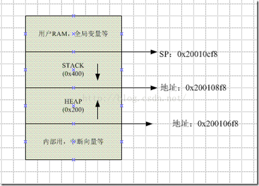
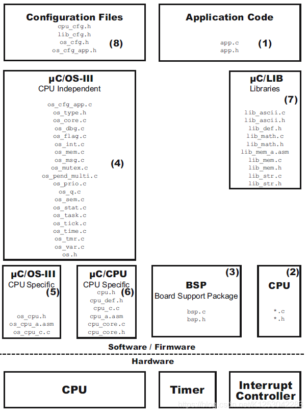

# UCOSIII 学习笔记

- [UCOSIII 学习笔记](#ucosiii-学习笔记)
  - [参考资料](#参考资料)
  - [第0章 前言](#第0章-前言)
  - [第二章 裸机系统和多任务系统](#第二章-裸机系统和多任务系统)
  - [第三章 任务的定义和任务切换的实现](#第三章-任务的定义和任务切换的实现)
    - [开始写内核](#开始写内核)
      - [UCOSIII 内核文件的分类](#ucosiii-内核文件的分类)
      - [任务的定义与任务切换的实现](#任务的定义与任务切换的实现)
      - [阻塞延时与空闲任务](#阻塞延时与空闲任务)
      - [时间戳](#时间戳)
      - [临界段](#临界段)

## 参考资料

- 网上野火提供的资料

参考文档：https://doc.embedfire.com/rtos/ucos/i.mx_rt1052/zh/latest/zero_to_one/foreword.html
参考视频：https://www.bilibili.com/video/av62027241/

## 第0章 前言

- 学习一款操作系统：应该学习它的原理，框架，思想，实现方式；
- RTOS 和 裸机开发区别还是挺大的
- 学习 UCOSIII 分为两步
  - 1、任务，任务栈，任务控制块，调度器，状态，任务列表等
  - 2、信号量，互斥量，消息队列，内存管理；IPC 通信等
- uCOS-III：Micor C OS Three 微型 C 操作系统 第三代
  - Micrium 公司开发

## 第二章 裸机系统和多任务系统

- 轮询系统：只有一个死循环，延时控制
  - 上学的时候用的系统，只能用在简单的顺序执行的程序中
- 前后台系统：加入中断，在中断中响应，在轮询死循环中完成；中断是前台，轮询系统是后台
  - 中小型系统中用的比较多，响应快速
  - 就是现在定时 4ms 的系统
- 多任务系统：RTOS 事件响应在中断中，事件处理在任务中；
  - 任务也有优先级，优先级高的任务会被先执行，使用调度器对任务调度
  - 比如：一个任务被挂起，当中断中产生事件，恢复任务，按优先级执行任务
  - 中断要快进快出

## 第三章 任务的定义和任务切换的实现

- 作业：自己动手把 UCOS 中的源码提取出来，简单化，写一个最简单的 UCOS 内核；
- SP 栈指针，有两种，详情参考 Cortex-M3 内核手册
  - PSP：任务指针，在任务中使用
  - MSP：主栈指针，在 RAM 中使用，裸机开发使用的都是主栈指针，或中断中使用
- 任务栈的初始化，也要参考 Cortex-M3 内核手册
- PendSV 异常服务中断：用于实现任务的切换；移植的时候需要修改
- SysTick 滴答定时器：时基；移植的时候需要修改

### 开始写内核

- 栈（stack）：存放函数参数，局部变量，由被编译器分配和释放
  - 数据结构是栈，先进后出
  - STM32 中大小是 0x400
- 堆（heap）：有程序员分配和释放，内存分配 malloc，使用 free 回收
  - 数据结构是链表
  - STM32 中大小是 0x200
- 全局变量和静态变量：是放到一起的
- 栈，堆，全局变量都是存放在 RAM 中，相邻的
  - 上电后，MCU 初始化会先在 RAM 中分配用户的全局变量和静态变量；再分配栈空间；再分配堆空间；
  - 栈是向低地址扩展
  - 堆是向高地址扩展
  - 注意：栈和堆是会溢出的，并且不会报错，后果严重；
  - 栈和堆的大小不能超过 MCU 的 RAM
- 注意：如何查看 .map 文件，对照地址，验证存储区；这个调试的时候要看一下

任务的堆栈

- 裸机系统中，只有一个主栈，所有的函数共享，随意使用，没有区别对待
- 多任务系统中，每个任务都有自己的栈，函数体，任务控制块
  - 任务自己的栈，就是一个数组，任务的数据都存放在这个数组中
  - 任务栈存储在全局变量中，不占用系统的 0x400 空间

#### UCOSIII 内核文件的分类

- 参考网址：https://blog.csdn.net/K1253042283/article/details/108913938

分析内核文件 cpu.h; cpu_cfg.h; cpu_def.h; 的内容

- 代码：cpu_def.h  定义 CPU 的宏定义
  - 字长的宏；CPU 大端模式和小端模式的宏；
  - 栈的增长方式的宏；关键段的方式宏；
- 代码：cpu_cfg.h  配置 CPU 功能
  - 使能中断使能时间测量；
  - 使能汇编语言计算前导 0 个数
- 代码：cpu.h  包含文件 cpu_def.h 和 cpu_cfg.h 配置 CPU
  - 数据类型定义；字长；小端模式；向下增长；
  - 栈的数据类型；关键段使用局部变量的访问；
  - 开中断，关中断定义；使用汇编语言编写；
  - 寄存器地址，寄存器位的定义；

- STM32 是小端模式；
  - 大端模式：高位放低地址，低位放高地址
  - 小端模式：高位放高地址，低位放低地址
- STM32 栈的增长是向下的；
- 注意：网上有代码可以验证 STM32 是小端模式，栈的增长方式；可以验证一下

#### 任务的定义与任务切换的实现

任务控制块 TCB（Task ControlBlock）

- UCOSIII 的函数命名规则：
  - 以OS_开头的函数表示内部函数，只能由μC/OS-III内部使用。
  - 紧接着是文件名，表示该函数放在哪个文件，最后是函数功能名称。

UCOSIII 中 os.h 和 os_var.c 只声明一次全局变量

- 一般情况下，对一个全局变量，是在 C 文件里面定义，在头文件里面声明，哪里需要使用，就再哪里用 extern 声明
- 那么怎么声明一次全局变量呢？
  - 在 os.h 中声明全局变量，在 os_ver.c 中有定义宏 OS_GLOBALS 其他包含 os.h 的文件没有定义它
  - 在 os_ver.c 因为有宏 OS_GLOBALS 相当于是定义 OS_EXT 是空
  - 其他包含 os.h 的文件没有定义 OS_GLOBALS 相当于是声明 OS_EXT 是 extern

OS系统初始化一般是在硬件初始化完成之后来做的

- 即 OSInit(OS_ERR * p_err) 应该在 LedInit(), KeyInit(); 等硬件功能初始化之后

#### 阻塞延时与空闲任务

- 阻塞延时：当任务需要延时的时候，我们不能让 CPU 空等，应该去执行其他任务
  - RTOS 的延时叫阻塞延时；当任务延时时间到，后重新获得 CPU 使用权
- 空闲任务：当没有任务要执行时，应该执行空闲任务
  - 进入空闲任务，可让单片机进入休眠或低功耗模式

#### 时间戳

- 时间戳：就是一个时间点，TimeStart，TimeEnd
- 在程序中，需要测量一段代码的时间，怎么做呢？
  - 硬件定时器，测量的是 us 级别的；而执行一条语句的时间是 ns 级别的 1/72000000=14ns；不能用
  - ARM M3 内核中有一个 DWT（数据观察点与跟踪），记录的 HCLK 运行的个数；
- DWT 有一个 32 位的计数器 CYCCNT，用来记录 HCLK 的个数，最大计数 2 的 32 次方乘 14ns 等于 60s

在程序中测量时间

- 记录开始的 DWT 的 CYCCNT 的个数 TimeStart
- 记录结束的 DWT 的 CYCCNT 的个数 TimeEnd
- TimeStart - TimeEnd = 代码执行时间

#### 临界段

- 临界段代码，即不可被分割的代码；不能被中断打断，也不能被调度器任务切换
  - 任务切换是通过触发 PendSV 中断产生的；
  - 所以，对临界段代码的保护，需要控制中断

在 关中断（ CPU_SR_Save() ） 和 开中断 （ CPU_SR_Restore() ） 中使用 PRIMASK 是为了防止临界段嵌套

- 临界段嵌套退出里面一层之后，PRIMASK = 0 这个时候再来中断可能会执行中断，这是有问题的

测量关中断的时间

- 1、测量总的关中断时间
- 2、测量最近一次关中断的时间

代码调试点

- 1、关中断，开中断
- 2、临界段嵌套
- 3、测量关中断时间（总中断，最近一次中断）
