# 嵌入式实时操作系统 μCOS-II 原理及应用 -- 任哲

- [嵌入式实时操作系统 μCOS-II 原理及应用 -- 任哲](#嵌入式实时操作系统-μcos-ii-原理及应用----任哲)
  - [前言](#前言)
  - [第一章：嵌入式实时操作系统的概念](#第一章嵌入式实时操作系统的概念)
  - [第二章：预备知识](#第二章预备知识)
    - [开发工具](#开发工具)
      - [学习 GCC](#学习-gcc)
      - [学习 make 及 makefile](#学习-make-及-makefile)
      - [批处理文件](#批处理文件)
      - [PowerShell 的一些知识点](#powershell-的一些知识点)
    - [常用的数据结构](#常用的数据结构)
  - [第三章：uC/OS-II 中的任务](#第三章ucos-ii-中的任务)
    - [3.1 任务的基本概念](#31-任务的基本概念)
    - [3.2 任务堆栈](#32-任务堆栈)
    - [3.3 任务控制块及其链表](#33-任务控制块及其链表)
    - [3.4 任务就绪表及任务调度](#34-任务就绪表及任务调度)
    - [3.5 任务的创建](#35-任务的创建)
    - [3.6 任务的挂起和恢复](#36-任务的挂起和恢复)
    - [3.7 其他任务管理函数](#37-其他任务管理函数)
    - [3.8 uCOSII 的初始化和任务的启动](#38-ucosii-的初始化和任务的启动)
  - [第四章：uC/OS-II 的中断和时钟](#第四章ucos-ii-的中断和时钟)
    - [4.1 uCOSII 的中断](#41-ucosii-的中断)
    - [4.2 uCOSII 的时钟](#42-ucosii-的时钟)
    - [4.3 时间管理](#43-时间管理)
  - [第五章：任务的同步与通信](#第五章任务的同步与通信)
    - [5.1 任务的同步和事件](#51-任务的同步和事件)

## 前言

- Linux 相当庞大，没有一定基础，直接学习比较难；
- uCOS 奠定基础，再去学习 Linux 可能更容易理解；
- 操作系统都是触类旁通的，学会一款，其他上手很快；

## 第一章：嵌入式实时操作系统的概念

- 它是多任务的，抢占式的，且要满足实时性，即任务切换时间应与系统任务数量无关，且中断延迟的时间是可预知尽量短；

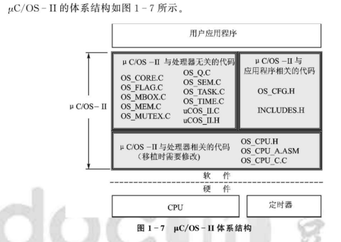

## 第二章：预备知识

### 开发工具

好的开发工具：GCC；make 工具及 makefile；

- 任哲这本书里面用的是 “Borland C 3.1” 这是一款在 PC 编译 C 文件的软件
- 这本书的出版时间是 2006 年，BC3.1 是一款比较老的软件，基本现在都淘汰不用
- 现在比较流行的是 GCC 所以，要先学习 GCC 编译 C 文件

#### 学习 GCC

参考网址：https://blog.csdn.net/qq_42475711/article/details/85224010

- GCC（GNU C Compiler）即GNU c编译器；它是编译器，用来编译 C 语言；
- 现在 GCC 拓展称为（GNU Compiler Collection）即 GNU 编译器套件；可以编译 C,C++,Java 等；所以称为编译器套件
- GUN 是一个技术组织，建立自由软件基金会，发行了 GPL（GUN General Public License）GUN 通用公共授权书
  - 后来 Linux 遵循 GPL，自由软件从此迅速发展，Linux 越来越强大

下载安装 GCC：https://osdn.net/projects/mingw/releases/

- MinGW（Minimalist GUN for Windows）：Windows 上的极简 GUN
- 安装好后，把 MinGM 的 bin 目录加入到环境变量的 path 中，这样 dos 在任意目录都可以调用 GCC
  - 添加环境变量的作用就是让 dos 或者其他软件可以访问到环境变量里面的内容
  - Windows 运行程序会从环境变量中浏览可执行命令 cmdlet

GCC 常用指令讲解

- 用 GCC 在 Windows 上编译 .c 文件并非直接生成 .exe 文件（Linux上为*.out）中间还经历了预处理、编译和汇编几个过程
- .c 预处理 .i 编译 .s 汇编 .o 连接 .exe(out)

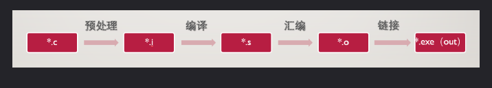

- gcc Demo.c; Demo.c 文件 -> a.exe； a.exe 是默认生成的文件名；
- -o（指定文件名） 指令：
  - 使用命令：gcc Demo.c -o Demo.exe; 指定文件名
  - 使用命令：gcc Demo.c -o ..\Demo.exe; 指定生成文件目录和文件名
- -E（预处理）指令：
  - 将执行预处理操作也即生成 *.i 文件, gcc 编译器将对 # 开头的指令进行解析
  - 使用命令：gcc -E Demo.c -o Demo.i; 把 Demo.c 预处理成 Demo.i
  - 预处理阶段的动作：把所有注释都去掉；头文件被包含，自动添加函数声明；宏常量替换；宏代码替换；
    - 因此，反编译回来的代码是没有注释的
  - 预处理会把工程整合成一个大文件；但是，不会检查语法错误
  - 使用命令：gcc -E Demo.c; 不指定输出的文件名时内容将会直接输出到Dos框中，而不会产生文件

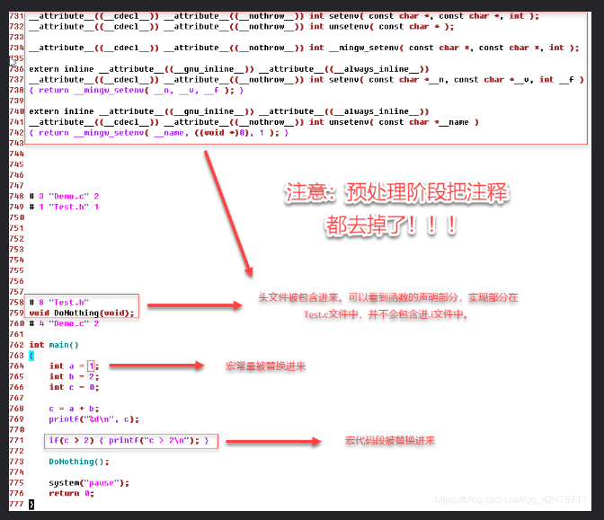

- -S（编译）指令：
  - 将 .i 文件中源码转化为汇编代码 .s 文件
  - 使用命令：gcc -S Demo.i -o Demo.s; Demo.s 文件记录 Demo.c 源码转化的汇编代码
  - 使用命令：gcc -S Demo.i 即不指定输出文件名，默认还是会在当前目录下产生文件 Demo.s
  - 如果此时出现语法错误，系统会提示错误；所以，对语法的检查是在编译阶段进行的
- -c（汇编）指令：
  - 将 .s 文件中的汇编源码转化为机器能执行的二进制机器码，生成文件 .o
  - 使用命令：gcc -c Demo.s -o Demo.o; Demo.o 为二进制文件,基本无法阅读
- gcc *.o（链接）指令：
  - 二进制文件 Demo.o 虽然已经机器码，但仍然无法运行；还要链接成 .exe 文件
  - 使用命令：gcc Demo.o -o Demo.exe
    - 在预处理和编译只检查函数声明，语法错误，函数调用处符合函数原型；不会检查函数定义
    - 而链接就是把所有函数原型关联起来，组成可运行的程序
  - 这里链接会报错，因为在链接过程中，找不到函数定义，无法关联；函数定义在另一个 .c 文件中
    - 标准库函数可以编译，是因为 gcc 在链接的时候，已经包含了路径
    - 自己写的 .c 文件，并没有包含进去
  - 成功链接的方法：
    - 1、去掉外部函数，或移动到 Dome.c 中
    - 2、将 Test.c 封装成静态库供其调用
  - 2、将 Test.c 封装成静态库供其调用
    - 使用命令：gcc -c Test.c -o Test.o 生成 Test.o 二进制文件；这里编译器自动对 Test.c 做预处理和编译操作
    - 使用命令：ar -rcs libTest.a Test.o  生成静态库
    - 使用命令：gcc Demo.o libTest.a -o Demo.exe 链接的时候，指明需要的静态库

总结：

- GCC 工作流程分成 4 步：hello.c -> hello.i -> hello.s -> hello.o -> hello.exe
  - 预处理（-E），生成 .i 文件
    - 宏替换；头文件展开；注释去掉；
    - 命令：gcc -E hello.c -o hello.i
  - 编译（-S），生成汇编文件 .s
    - 命令：gcc -S hello.i -o hello.s
  - 汇编（-c），生成二进制文件 .out
    - 命令：gcc -c hello.s -o hello.o
  - 链接，生成可执行文件 .exe
    - gcc hello.o -o hello
  - 通常一句命令：gcc hello.c -o hello; 可以直接转换成 .exe 文件，中间过程编译器会自动做
- 语法检错在编译阶段，预处理阶段只是宏替换；头文件展开；注释去掉；
- GCC 常用参数
  - gcc -v  查看GCC 版本
  - -I 指定头文件路径；如果头文件不在相同目录下，可以用 -I 包含
    - 命令：gcc hello.c -o hello -I ./include
  - -o 指定生成的程序的名称
    - gcc hello.c -o hello.exe
  - -g 使用gdb调试的时候必须加的参数；可以输出程序错误的文件名和行号
    - gcc -g Demo.c -o Demo.exe
  - -D 在编译的时候指定一个宏；传递这个宏到程序中
    - gcc test.c -o test -D DEBUG
  - -Wall 显示警告信息；gcc 默认不会显示警告
    - gcc -Wall Demo.c -o Demo.exe
- 强烈推荐编译 .c 文件命令：gcc -g -Wall Demo.c -o Demo.exe
  - 包含警告信号和错误提示文件行号
- 多个参数：gcc -g -Wall Demo.c -o Demo.exe -I .\include -D DEBUG_D
  - -I 包含头文件路径 .\include；-D 传递宏 DEBUG_D 到程序
- 如果有多个 .c 文件，在 main 中是不能调用的，因为找不到函数定义
  - 解决方法：将 .c 封装成静态库供其调用
  - 1、命令：gcc -c Test.c -o Test.o; 先把多个 .c 文件都转换为 .o 文件
  - 2、命令：ar -rcs libTest.a Test.o Test_1.o; 把 Test.o 和 Test_1.o 生成静态库 libTest.a
  - 3、命令：gcc Demo.c libTest.a -o Demo.exe 链接的时候，指明使用的静态库
  - 常用命令：gcc -g -Wall Demo.c .\include\libTest.a -o Demo.exe -I .\include -D DEBUG_D
- 代码路径：\Projects\GCC_Demo\Demo_HelloWorld

编译多个源文件

- 参考网址：https://www.cnblogs.com/postw/p/9670805.html
- 在同一路径下，创建多个 .c 源文件，如何编译？
  - 把 .c 文件都写到命令里面：gcc -g -Wall main.c hello.c -o main
- 代码路径：\Projects\GCC_Demo\Demo_Two_C_files

#### 学习 make 及 makefile

参考网址：https://blog.csdn.net/FRS2023/article/details/120839849

- make 工具：工程管理工具；通过脚本 makefile 管理工mingw32-make程项目
  - IDE 也使用 make 工具，只是隐藏起来了；
- makefile：就是对源文件进行编译和连接的脚本；用 DOS 命令写出来的文件
  - makefile 有自己的编码规则，在 DOS 中调用

GCC make 工具的安装

- 在安装 GCC 的时候，要安装包 'mingw32-base-bin' 这个包里面有 'mingw32-make.exe' 就是 make
- 在目录 C:\MinGW\bin 中把 'mingw32-make.exe' 改名为 'make.exe'; 或 copy 一份再改名都行

编写 makefile：

- 直接使用 make 默认执行第一个程序标号：target1
- 命令集中的所有命令都用 TAB 开头，不能用空格

```
## example 1：
target1:
	md 11
target2:
	md 22
target3:
	rd 11
	rd 22

## example 2：
######################################################################
# 创建 makefile 可执行文件
######################################################################
Get_main.exe:
	gcc -g -Wall main.c -o main.exe
	.\main.exe
Get_main.i:
	gcc -E main.c -o main.i
Get_main.s:
	gcc -S main.c -o main.s
Get_main.o:
	gcc -c main.c -o main.o
Clean:
	del main.i
	del main.s
	del main.o
```

- 为 makefile 的 target 添加依赖文件；
  - 依赖文件：就是执行 target 前需要先做的其他 target；
  - 通过时间戳判断；如果这些其他 target 文件没有更新，则跳过，有更新则编译，提高开发效率

```
######################################################################
# 创建 makefile 可执行文件
######################################################################
Get_main.exe: Get_main.i Get_main.s Get_main.o
	gcc -g -Wall main.c -o main.exe
	.\main.exe
Get_main.i: main.c main.h
	gcc -E main.c -o main.i
Get_main.s: main.c main.h
	gcc -S main.c -o main.s
Get_main.o: main.c main.h
	gcc -c main.c -o main.o
Clean:
	del main.i
	del main.s
	del main.o
```

- 伪目标
  - 使用 makefile 是创建目标文件的，但是有些需要添加路径、文件或需要清理文件
  - 这些操作不是真正的 target 所以叫伪目标
  - 使用 .PHONY: 定义伪目标；这样可以防止文件名和伪目标名一致时，导致伪目标无法执行

```
######################################################################
# 创建 makefile 可执行文件
######################################################################
Get_main.exe: Get_main.i Get_main.s Get_main.o
	gcc -g -Wall main.c -o main.exe
	.\main.exe
Get_main.i: main.c main.h
	gcc -E main.c -o main.i
Get_main.s: main.c main.h
	gcc -S main.c -o main.s
Get_main.o: main.c main.h
	gcc -c main.c -o main.o
# 使用 .PHONY: 定义伪目标
.PHONY: Clean Clean1
Clean:
	del main.i
Clean1:
	del main.s
	del main.o
```

- makefile 文件的命名
  - makefile 是 make 工具的默认调用文件; 用户也可以使用 make 调用任意文件
  - 该文件里面按照 make 语法编写脚本，可以保存为任意扩展名
  - 命令：make -f 文件名(包括扩展名)；
    - 例子：make -f makeV2.txt； make -f makeV2.ps1；
- makefile 变量的赋值；在 makefile 里面所有的变量都是字符串
  - 赋值: name = rick  引用：$(name)
  - '='; 可以赋值字符串，也可以赋值另一个变量
    -  赋值：name = rick;
    - 另一个变量：name_1 = $(name)
  - ':='; 使用 := 赋值的变量，始终不变，后面再对该变量赋值无效
  - '?='; 如果前面没有被赋值，那么就是 ?= 后的变量，如果之前已经被赋值了，那么就使用前面赋的值
  - '+='; 追加变量；

```
name = rick
curname = ENG
name += $(curname)

Print:
	echo $(name)
	echo $(curname)
```

#### 批处理文件

- 创建批处理文件：创建一个 .txt 文本文件，另存为 .bat 文件就可以了
  - .bat 文件就是批处理文件
- 代码路径：\Projects\GCC_Demo\Demo_Bat

```
@ECHO OFF
ECHO ********************************************
ECHO *  Batch file
ECHO ********************************************
MD WORK
MD OBJ
CD WORK
COPY ..\..\Demo_Make\makefile makeV2.MAK
make -f makeV2.MAK
CD ..\
DEL WORK
DEL OBJ
RD .\WORK
RD .\OBJ
PAUSE
```

- Powershell 脚本包含所有批处理文件 bat 中的内容，且更加强大，有 .net 的加持
  - 所以，基本上以后会用 PS 取代 bat 进行操作，并且 PS 更好用
  - bat 可以直接调用 PS 脚本
- 运行 bat 或在 PS 中运行脚本，使用 GCC 创建 Hello World 程序
- 代码路径：\Projects\BatAndMake

#### PowerShell 的一些知识点

- 变量
  - $local:a = "power"; 定义局部变量，未指定变量的默认值
  - $script:a = "power"; 定义脚本变量，在函数及脚本中所有位置都有效
  - $global:a = "power"; 定义全局变量，在函数及脚本以外也有效
  - $private:a = "power"; 定义私有变量，仅在当前作用域中有效
- 数组
  - $data = @(); 创建一个空数组
  - $data = @("aa","bb","cc"); 数组初始化
  - $data = @(dir .\main.exe); 把 main.exe 的路径放到数组中
- $_; 是一个变量，它遍历从前面的|(管道)传递的每个对象/元素。

### 常用的数据结构

- 程序控制块（代码控制卡）TCB（Task ControlBlock）：
  - 是一个结构体，管理代码段（函数指针），存储重要信息，相当于每个任务的身份证
- 链表：每个单元都有前端和后继指针
  - 每一个任务，有一个程序控制块，这些程序控制块也应该存储在一块，便于查找
  - 如果是少数几个任务，可以创建 tcb 数组形式
  - 如果任务很多，而 tcb 又比较大，用数组占用很多空间，这个时候就可以用链表存储
  - 这个存储很多任务控制块的链表就是注册表
  - 通常链表的查询是比较耗时的，需要从头开始，为了便于快速随机查询，再使用一个新的数组存储链表头
- 位图：实际上就是位存储
  - 对于只有两个状态的情况，用 1 和 0 来表示；比如任务块是否被占用

- 例 2-8 程序代码：\Projects\UcosIIBook_2-8
  - 练习程序控制块 TCB 结构体的创建和使用

## 第三章：uC/OS-II 中的任务

### 3.1 任务的基本概念

- 任务的组成：任务程序代码（函数），任务堆栈，任务控制块
  - 任务程序代码（函数）：就行任务要执行的代码
  - 任务堆栈：保存任务的数据
    - 具有私有空间的任务叫做进程；没有私有空间的任务叫做线程；
    - ucOS 是共用空间，所以，uCOS-II 中的任务属于线程
  - 任务控制块：身份证，记录任务的地址，代码地址，堆栈地址
- uCOS 有用户任务和系统任务
  - 用户任务：用户编写的任务，解决问题
  - 系统任务：系统自带的任务，查看系统状态
  - UCOS-II 目前最多含有 64 个任务

任务的状态

- 睡眠状态：只有代码，没有配备任务控制块的任务，永远不会运行
- 就绪状态：有代码，有配备任务控制块的任务，条件允许则运行
- 运行状态：UCOS 只有只有一个 CPU，任意时刻只有一个任务是运行状态，且更高优先级的任务都为等待状态
- 等待状态：正在运行的任务，需要某些条件，或等待时间才能运行，把 CPU 让给其他任务，则进入等待状态
- 中断服务状态：正在运行的任务，期间响应中断，执行中断服务程序了，则进入中断服务状态

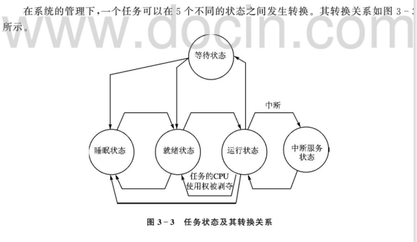

用户任务代码的结构

- 一个函数，里面一个超级循环
- OS_ENTER_CRITICAL(); 和 OS_EXIT_CRITICAL(); 开中断和关中断
  - 临界段：UCOS 中把受保护的段叫临界段
  - 临界段的访问不能有中断产生
- 所有任务的运行与终止，都是由操作系统来调度的

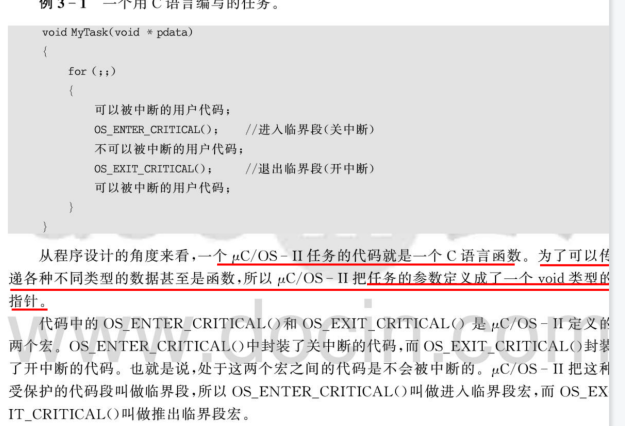

系统任务

- uCOS-II 中有两个系统任务：空闲任务和统计任务
  - 空闲任务（OSTaskIdle()）：是每个应用程序必须使用的；Idle 任务，保证计算机不会停下来
  - 统计任务（OSTaskStat()）：可选，每秒计算一次 CPU 在单位时间内使用百分比
    - 在 OS_CFG.H 中配置 OS_TASK_STAT_EN 为 1，且初始化 OSStatInit();

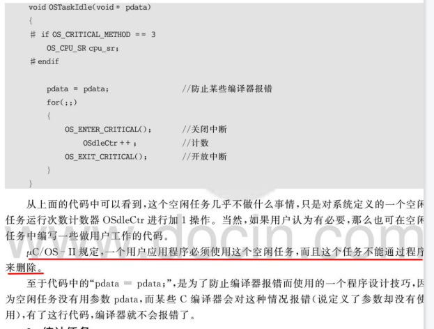

任务的优先级和优先级别

- uCOS 只有一个 CPU 执行多任务，就需要分别定义优先级
- uCOS 规定有 64 个任务，且有 64 个优先级，每个任务都对应一个优先级，不可重叠
- 数字越小，优先级越高
- 在 OS_CFG.H 中 OS_LOWEST_PRIO 用来设置优先级数量，最低优先级为 OS_LOWEST_PRIO-1
  - 系统默认把 OS_LOWEST_PRIO-1 的优先级赋给 OSTaskIdle，保证空闲任务的执行
  - 用户任务的优先级，在创建任务的时候显示定义；OSTaskCreat() 中的第 4 个参数 prio 指定
- 每个任务都有唯一一个优先级，所以，在 uCOS 系统中这个优先级序号也是任务标识

### 3.2 任务堆栈

- 堆栈：先进后出；
  - 作用：保存任务切换或响应中断时 CPU 寄存器中的内容；以及本任务数据存储
- 任务控制块中又一个指向该任务堆栈的指针

任务堆栈的创建

- uCOS 在 OS_CPU.H 定义了一个数据类型：OS_STK

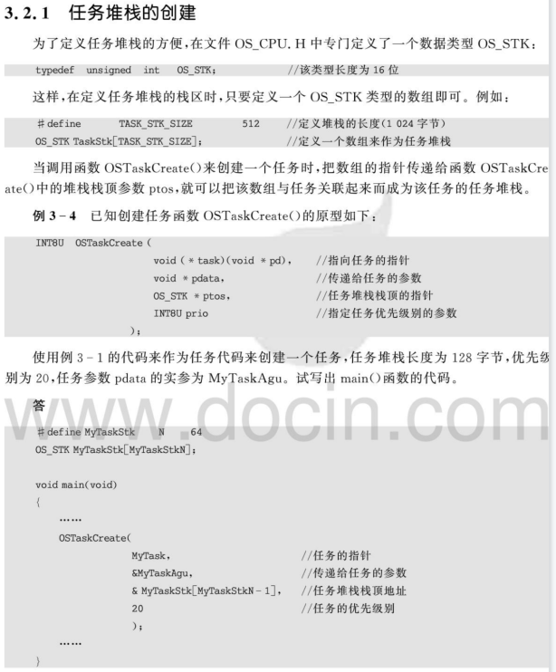

- 注意：不同的系统，堆栈的增长方向不同
  - 有向下增长：即栈顶是高地址，入栈到低地址
  - 有向上增长：即栈顶是低地址，入栈到高地址
- 这两种方式对堆栈的创建是不一样的
  - 在 OS_CFG.H 中有 OS_STK_GROWTH 选择堆栈的增长方式
  - OS_STK_GROWTH = 1; 向下增长，所以，栈顶是最高地址
  - OS_STK_GROWTH = 0; 向上增长，所以，栈顶是最低地址

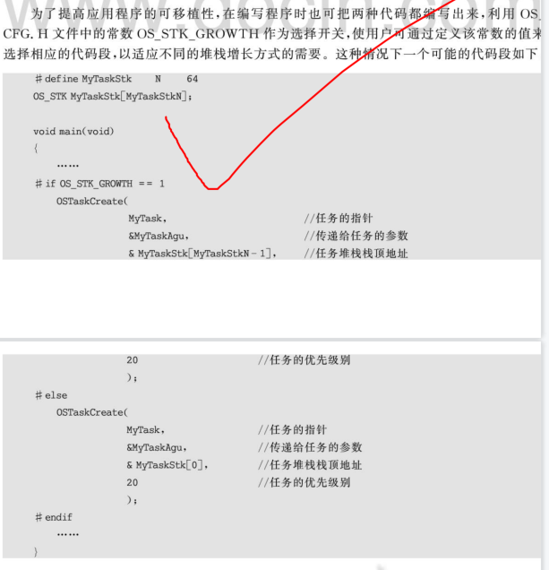

任务堆栈的初始化

- 当 CPU 运行一个任务时，需要把改任务的私有数据（任务指针，PSW）等传递给内核
  - 这些数据存储任务各自的堆栈中，所以，需要提前初始化他们的堆栈
- 注意：在 uCOS 中，堆栈初始化 OSTaskStkInit() 是由 OSTaskCreate() 来调用的
  - 在移植 uCOS 的时候，应该对 OSTaskStkInit 修改

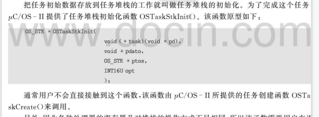

### 3.3 任务控制块及其链表

- uCOS-II 把系统所有任务的任务控制块链接成两条链表
  - 任务控制块是结构体类型 OS_TCB; OSTaskCreate 函数创建一个用户任务的时候，会初始化对应任务控制块
  - 第一条链表：空任务块链表，未分配控制块
  - 第二条链表：任务块链表，已分配控制块
- 在调用 OSInit 对系统初始化的时候，先创建一个 OSTCBTb1[] 数组，然后把数组连接成一个空任务控制块链表
  - 在 OS_CFG.H 中宏定义 OS_MAX_TASKS 表示用户任务的最大数目
  - 在 UCOS_II.H 中宏定义 OS_N_SYS_TASKS 表示系统任务的数目（一般是2 个，空闲任务和系统任务）

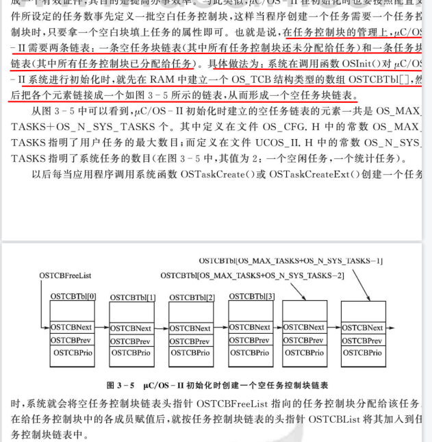

- 创建了空任务块链表，为了快速访问，uCOS 在 uCOS_II.H 中定义了数据类型为 OS_TCB * 的 OSPrioTb1[] 数组
  - OSPrioTb1[] 以任务的优先级为顺序，存放指向各个任务控制块的指针
  - 这样访问任务控制块时，就不用遍历链表，遍历数组 OSPrioTb1 更快
- 同时，uCOS 还定义了当前任务 OS_TCB OSTCBCur 指向当前正在运行的任务控制块
- OSTaskDel() 删除一个任务，就是把该任务的任务控制块归还到空任务控制块链表

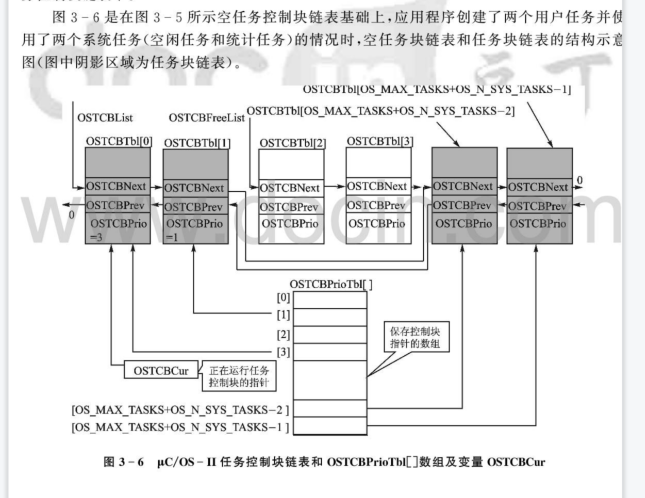

- 任务控制块初始化
  - 系统会在 OSTaskCreate() 创建一个任务时，调用 OSTCBInit() 对任务控制块初始化

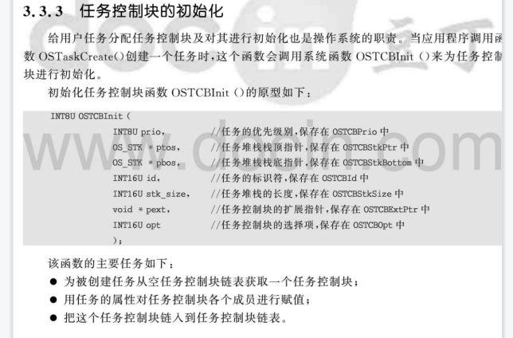

### 3.4 任务就绪表及任务调度

- 任务就绪表：存储已经就绪的任务
  - 系统中运行的任务都是从就绪任务中选择一个来运行的
- 任务调度：通过某个算法，在就绪表中选择一个任务，调用它，调度器
- UCos-II 最多有 64 个任务，按优先级排序；内部结构是 OSRRdyTb1[8] 和 OSRdyGrp 组成
  - OSRRdyTb1[] 是 uc8 的数据类型，可以存储 8 个位，每个位是一个任务；1 为就绪，0 未就绪
  - OSRdyGrp 是 uc8 的数据类型，8 个位，每个位表示 OSRRdyTb1[0-8]
  - 所以，OSRdyGrp * OSRRdyTb1[] = 64 个任务
- 优先级是一个 uc8 的数据，对应的 OSRdyGrp 和 OSRRdyTb1[] 是什么呢？
  - 64 二进制是 00111111；所以，第 bit[0-2] 表示 OSRRdyTb1[] 下标，最大是 7
  - 第 bit[3-5] 表示 OSRdyGrp 下标，最大是 7
  - 比如：优先级是 prior = 30 对应的是哪一位？
    - 30 = 00011110； OSRdyGrp = 3；OSRRdyTb1[] = 6
    - 所以，是 OSRRdyTb1[3] 的 D6 位置 1；

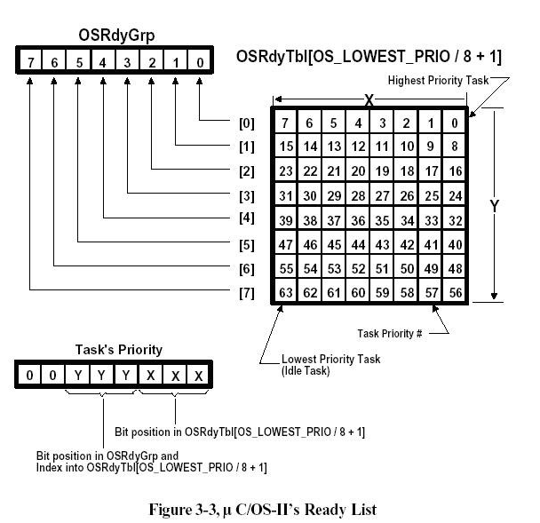

对任务就绪表的操作

- 三个操作：登记，注销和最高优先级就绪任务查找
  - 登记：把优先级对应 bit 置 1
  - 注销：把优先级对应 bit 置 0，然后把 OSRdyGrp 也置 0
  - 最高优先级查找：这里使用空间换时间的方法，创建一个表 OSUnMapTbl[]，表示的是一个8bit的数据最低位为1的位置
    - 例如：1000 0000 最低位为1的位置是在第7位，那么OSUnMapTbl[128]的值就是7；
    - 1000 0010 最低位为1的位置是在第1位，那么OSUnMapTbl[130]的值就是1；
    - 参考网址：https://www.cnblogs.com/luosongchao/p/3295545.html

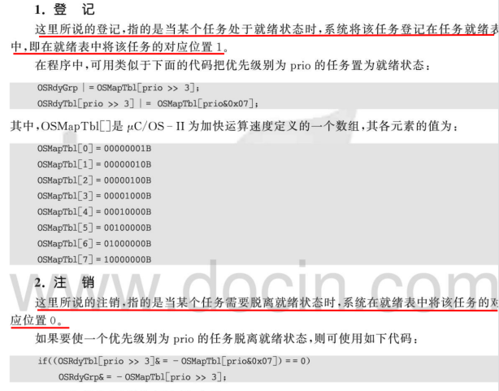
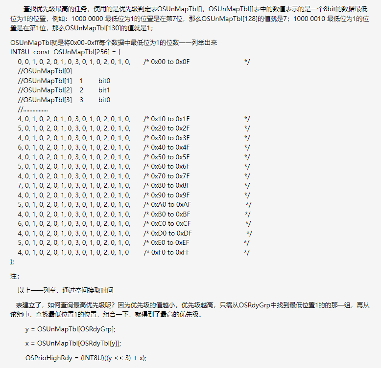

任务调度

- 系统总是想运行就绪任务中优先级最高的任务，这需要调度器 OSSched()
  - 什么时候使用调度器：两种情况
    - 系统或用户任务调用系统函数
    - 中断服务程序结束时
- 任务切换：CPU 当前正在运行任务，但出现更高优先级任务，转去执行其他任务；切换过去了
- 任务调度：按某种规则，比如时间达到，执行其他任务；叫任务调度
- 调度器 OSSched() 的主要工作有两项
  - 1、获得最高优先级就绪任务控制块
  - 2、实现任务切换
- 调度器有两种：任务级调度器 OSSched() 和 中断级调度器 OSIntExt()

获得最高优先级就绪任务控制块

- OSSchedLock() 和 OSSchedUnlock() 给调度器上锁和解锁
  - OSLockNesting 上锁 +1 解锁 -1；反应调度器是否上锁
- OSIntNestig 有中断服务程序调用 +1；退出则 -1；反应中断是否调用调度器
- OSTCBHighRdy 存储的是高优先级任务的 TCB
- OSTCBCur 存储当前任务 TCB

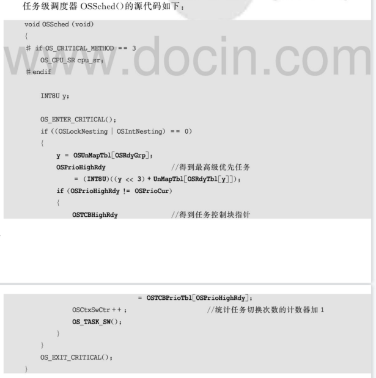

任务切换

- 任务切换必须要保存现场；CPU 的 PC、PSW、通用寄存器的数据，
  - 把自身的数据出栈给 CPU，完成之后再恢复现场
- OSCtxSw() 实现任务切换，做 7 项工作

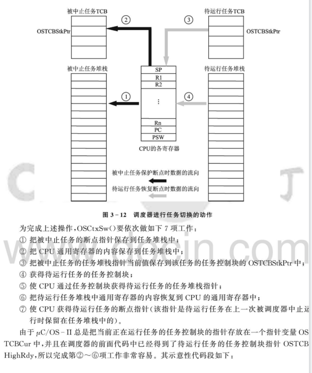

- 要保存 CPU 的 PC 没有办法直接读取和写入；
  - 需要依靠 CALL，INT，IRET 来把断点指针推入 CPU 的 PC寄存器
- 让中断向量指向 OSCtxSw() 就是中断服务函数
- 宏定义：OS_TASK_SW() 用来产生中断，实现任务切换

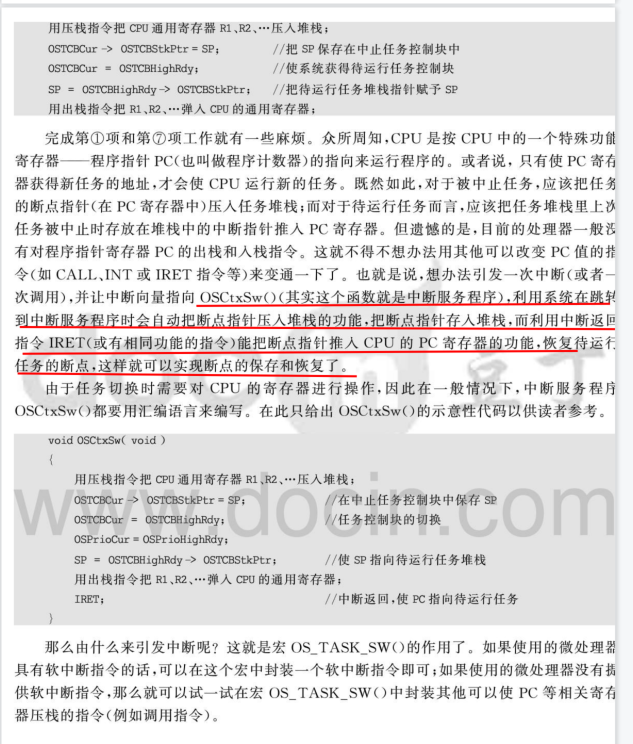

### 3.5 任务的创建

- 创建一个任务，就是创建一个任务控制块，并把任务代码和任务堆栈关联起来形成一个完整任务
  - 运行任务：让任务进入就绪状态，引发一次任务调度
- 创建任务的函数：OSTaskCreate() 和 OSTaskCreateExt()
  - OSTaskCreateExt 是 OSTaskCreate 的扩展，增加了一些功能
  - OSTaskCreate() 内部代码参考源码
- 创建任务的一般方法
  - 在调用 OSStart() 之前创建一个起始任务，设置为最高优先级
  - 在这个起始任务中，再去创建其他任务
  - UCOS-II 中不允许在中断服务程序中创建任务
- 例子：创建两个任务，一个起始任务，一个用户任务，并且调度

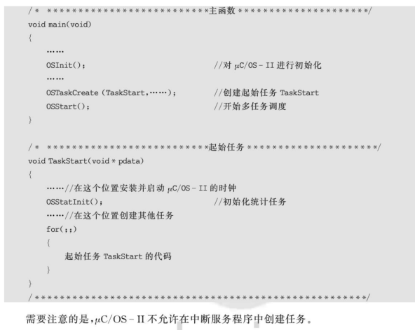

- 注意：这本书里面使用的是 PC 上的 Borland 3.1，我没有办法使用
  - 所以，先要移植 UCOSII 到现有的 STM32F103C8T6 上，能够正常运行后，才能继续试验
  - 代码参考：

### 3.6 任务的挂起和恢复

- 挂起（OSTaskSuspend()）：就是停止这个任务的运行，使任务变为等待状态
- 恢复（OSTaskResume()）：使挂起的任务恢复为就绪状态

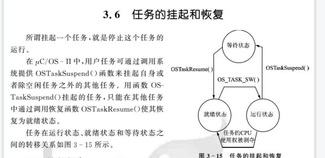

挂起任务

- 函数原型：INT8U OSTaskSuspend(INT8U prio)
- 可以挂起自身或者其他任务
  - 挂起自身：使用在 uCOS.H 中宏 OS_PRIO_SELF 为参数
    - 工作：删除任务的就绪状态；在任务控制块成员 OSTCBStat 中记录挂起状态；
    - 且引发一次调度 OSSched()，让出 CPU
  - 挂起其他任务：只要删除就绪状态，存储挂起记录，不需要让出 CPU

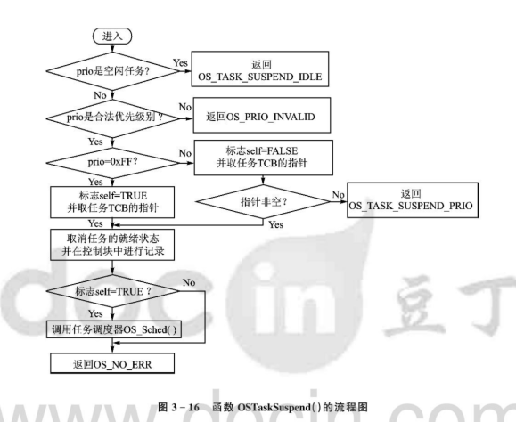

恢复任务

- 函数原型：INT8U OSTaskResume(INT8U prio)
- 工作：判断任务是存在的挂起任务；且不是等待任务（任务控制块成语 OSTCBDly = 0）；
  - 清除任务控制块成员 OSTCBStat 中挂起状态，变为就绪状态，调度一次 OSSched() 占用 CPU

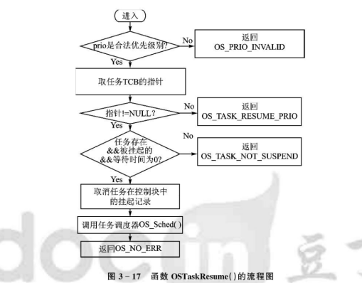

- 例子：任务的挂起和恢复试验；调度器加锁和解锁试验
- 注意：调度器如果加锁，就是不进行任务调度，加锁的该任务独占 CPU 运行；
  - 加锁解锁必须成对使用
- 代码参考：

### 3.7 其他任务管理函数

- 任务优先级的修改 OSTaskChangePrio()
  - 任务的优先级可以改变，调用 INT8U OSTaskChangePrio(INT8U oldprio, INT8U newprio) 进行修改
  - 成功则返回值：OS_NO_ERR
- 任务删除：就是让任务进入睡眠状态；将该任务的任务控制块链表，归还给空任务控制块链表；把就绪状态置 0、
  - INT8U OSTaskDel(INT8U prio); prio:要删除的任务优先级
  - 由于删除的任务，可能占用系统共用资源等；为避免删除任务时，把共用资源删除，以下解决办法
    - 任务提出删除其他任务请求，其他任务在内部根据请求删除自身
    - 因此需要双方通信确定删除方，与被删除方；
  - 提出删除任务请求：INT8U OSTaskDelReq(INT8U prio)
  - 任务控制块成员：OSTCBDelReq 存储删除请求状态
  - 调用 OSTaskDelReq() 有两种参数
    - 1、删除其他任务：参数是 其他任务优先级 prio; 返回值是 OS_TASK_NOT_EXIST
    - 2、删除自身：参数是：OS_PRIO_SELF; 返回值是 OS_TASK_DEL_REQ
  - OSTimeDly(1); 延时一个时钟节拍

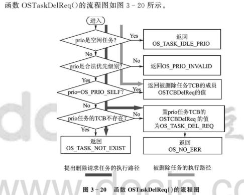
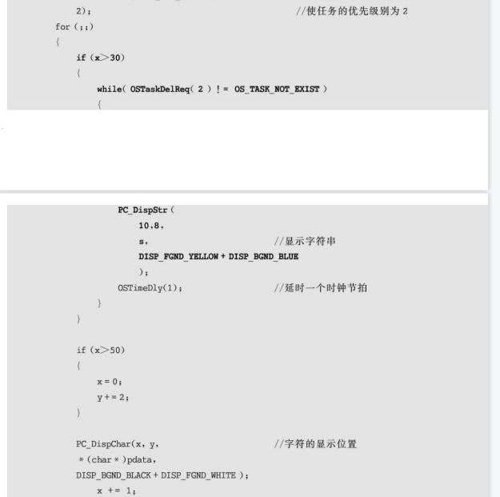
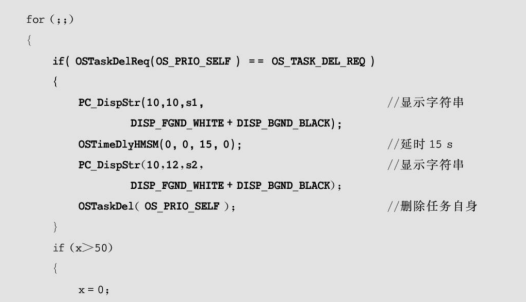

- 查询任务的信息：获得该任务的任务控制块
  - INT8U OSTaskQuery(INT8U prio, OS_TCB * pdata)
  - 参数 prio：要查询的优先级号
  - 参数 pdata：把该优先级的 任务控制块存储到 pdata 这个指针中

### 3.8 uCOSII 的初始化和任务的启动

- uCOSII 的初始化；OSInit()
  - 初始化所有全局变量；OSPrioCur，OSPrioHighRdy，OSTime....
  - 初始化空链表和其余4个链表；OSTCBFreeList
  - 初始化空闲任务，或统计任务；默认空闲任务在最低优先级（OS_LOWEST_PRIO）;
    - 统计任务，需要使能 OS_TASK_STAT_EN=1 默认在次最低有优先级（OS_LOWEST_PRIO-1）
  - 初始化任务就绪表，任务控制块优先级数组 OSTCBPrioTb1[OS_LOWEST_PRIO+1]

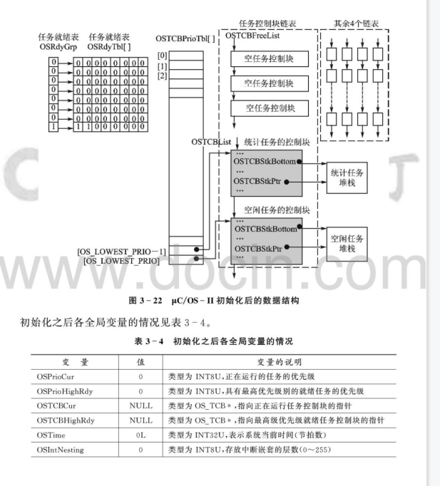

- uCOSII 的启动；OSStart()
  - 设置 OSRunning=TRUE，并把最高优先级任务的栈指针，任务控制块加载到 CPU
  - 强制中断返回，使系统运行

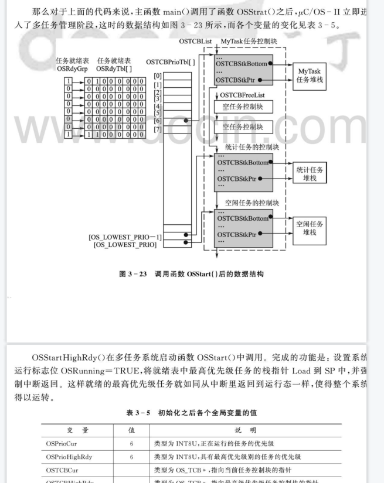

## 第四章：uC/OS-II 的中断和时钟

### 4.1 uCOSII 的中断

- uCOSII 是可剥夺型的内核；中断服务子程序运行结束后，系统会进行一次任务调度，运行优先级最高的就绪任务，不一定是返回之前任务
- uCOSII 允许中断嵌套，OSIntNesting 记录中断嵌套的层数
- OSIntEnter(void) 使 OSIntNesting++；
- OSIntExit(void) 使 OSIntNesting--；同时，需要查找最高优先级任务，且完成任务切换

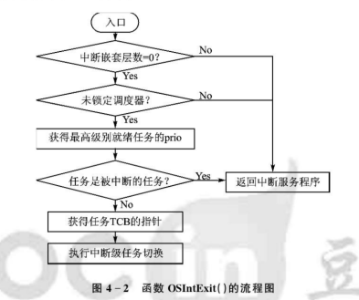
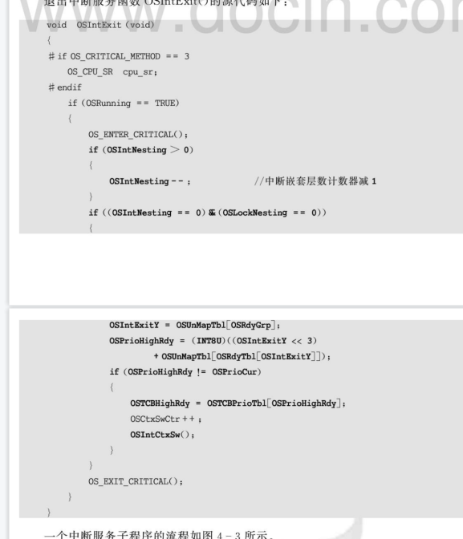

- 中断级任务切换函数 OSIntCtxSw()
  - 在执行中断最后，要进行中断级任务切换，就是确定最高优先级任务，并完成出栈
  - 任务级任务切换是 OSCtxSW() ; 功能差不多，只是在中断中 断点保护工作已经由中断服务程序完成
- 应用程序中的临界段：不希望被中断打断的代码段
  - 使用宏 OS_ENTER_CRITICAL() 和 OS_EXIT_CRITICAL() 封装
  - 其中终止和恢复代码的命令和硬件相关，移植的时候需要修改
  - 宏的修改有三种方法：修改参数 OS_CRITICAL_METHOD=1,OS_CRITICAL_METHOD=2,OS_CRITICAL_METHOD=3

### 4.2 uCOSII 的时钟

- 使用硬件定时器产生一个时钟节拍 Time Tick，用来处理延时，超时等，毫秒级
- 中断服务程序：OSTickISR() 在其中调用 OSTimeTick(void)
  - OSTimeTick() 时钟节拍服务函数，主要做两件事
  - 1、计数器 OSTime++；OSTCBDly--；
  - 2、遍历所有任务控制块，使已经到了延时时限且是非挂起任务进入就绪状态

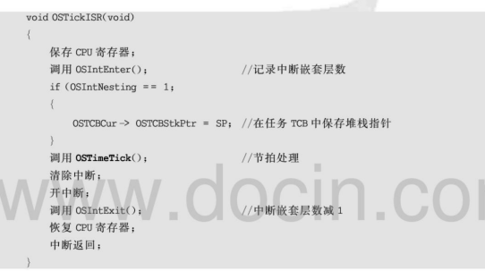
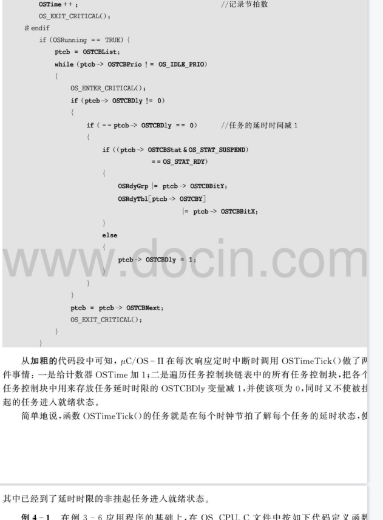

- 钩子函数 OSTimeTickHook(void)
  - 被时钟节拍服务函数 OSTimeTick() 调用，而 OSTimeTick() 被中断服务程序 OSTickISR() 调用
  - 因此钩子函数的设计就是让用户在时钟节拍中断中处理自己的代码
  - 钩子函数有 10 个； OSStkInitHook(),OSInitHookBegin()....

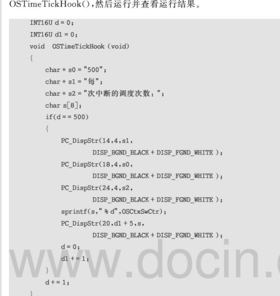

### 4.3 时间管理

- 任务的延时
  - 每个任务都是无限循环，UCOSII 又是抢占式内核；所以，为了避免高优先级任务独占 CPU
  - UCOSII 要求除休眠任务以外，每个任务都有在适当位置调用 OSTimeDly() 暂停一段时间，让出 CPU 的使用权
  - OSTimeDlyHMSM(hours, min, sec, milli); 带参数的 OSTimeDly()

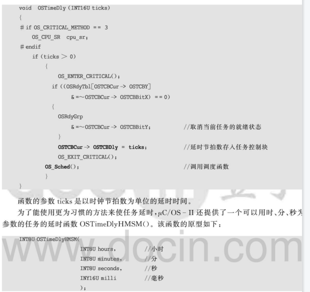

- 取消任务的延时
  - INT8U OSTimeDlyResume(INT8U prio)
  - 就是取消 prio 任务的延时时间

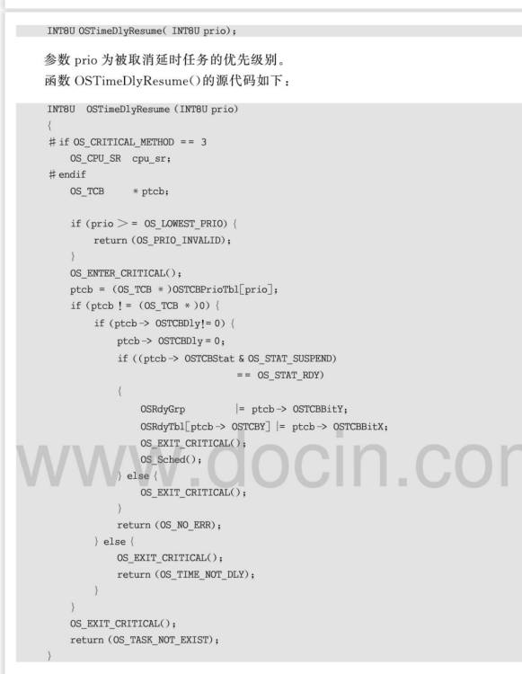

- 获取和设置系统时间
  - uCOSII 中有 INT32U 的全局变量 OSTime 来记录时钟节拍数
  - OSTimeGet() 获取 OSTime 的值；OSTimeSet(INT32U ticks) 设置 OSTime 的值

## 第五章：任务的同步与通信

### 5.1 任务的同步和事件

- 嵌入式系统中的多个任务，不可避免要访问共享资源；要保证各个任务之间的合作无冲突，需要建立制约关系
  - 第一种：任务间应该具有互斥关系，对共享资源，如果一个任务正在使用，其他任务只能等待
  - 第二种：先后次序，一个任务要等其他任务先完成，才能继续执行，否则只能等待
- 任务间的这种制约性的合作运行机制叫做任务间的同步

使用信号量、邮箱（消息邮箱）、消息队列这种中间环节来实现任务之间的通信；这种中间环节被统一称为 “事件”

- 互斥型信号量（二值信号量）：相当于标志位，只有 0 和 1 两种状态；
- 信号量：设定访问最大容量，每有一个任务访问，就自动加一，判断计数值大于 0 就可以访问；
