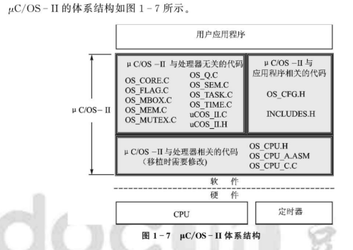
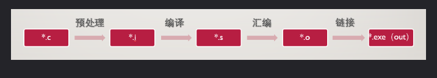
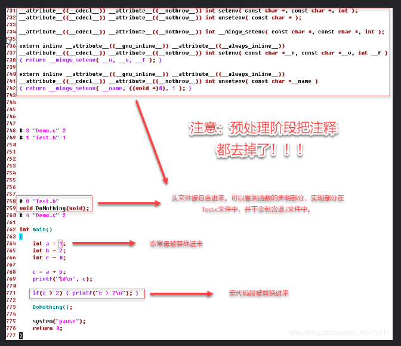

# 嵌入式实时操作系统 μCOS-II 原理及应用 -- 任哲

- [嵌入式实时操作系统 μCOS-II 原理及应用 -- 任哲](#嵌入式实时操作系统-μcos-ii-原理及应用----任哲)
  - [前言](#前言)
  - [第一章：嵌入式实时操作系统的概念](#第一章嵌入式实时操作系统的概念)
  - [第二章：预备知识](#第二章预备知识)
    - [开发工具](#开发工具)
      - [学习 GCC](#学习-gcc)
      - [学习 make 及 makefile](#学习-make-及-makefile)
      - [批处理文件](#批处理文件)

## 前言

- Linux 相当庞大，没有一定基础，直接学习比较难；
- uCOS 奠定基础，再去学习 Linux 可能更容易理解；
- 操作系统都是触类旁通的，学会一款，其他上手很快；

## 第一章：嵌入式实时操作系统的概念

- 它是多任务的，抢占式的，且要满足实时性，即任务切换时间应与系统任务数量无关，且中断延迟的时间是可预知尽量短；



## 第二章：预备知识

### 开发工具

好的开发工具：GCC；make 工具及 makefile；

- 任哲这本书里面用的是 “Borland C 3.1” 这是一款在 PC 编译 C 文件的软件
- 这本书的出版时间是 2006 年，BC3.1 是一款比较老的软件，基本现在都淘汰不用
- 现在比较流行的是 GCC 所以，要先学习 GCC 编译 C 文件

#### 学习 GCC

参考网址：https://blog.csdn.net/qq_42475711/article/details/85224010

- GCC（GNU C Compiler）即GNU c编译器；它是编译器，用来编译 C 语言；
- 现在 GCC 拓展称为（GNU Compiler Collection）即 GNU 编译器套件；可以编译 C,C++,Java 等；所以称为编译器套件
- GUN 是一个技术组织，建立自由软件基金会，发行了 GPL（GUN General Public License）GUN 通用公共授权书
  - 后来 Linux 遵循 GPL，自由软件从此迅速发展，Linux 越来越强大

下载安装 GCC：https://osdn.net/projects/mingw/releases/

- MinGW（Minimalist GUN for Windows）：Windows 上的极简 GUN
- 安装好后，把 MinGM 的 bin 目录加入到环境变量的 path 中，这样 dos 在任意目录都可以调用 GCC
  - 添加环境变量的作用就是让 dos 或者其他软件可以访问到环境变量里面的内容
  - Windows 运行程序会从环境变量中浏览可执行命令 cmdlet

GCC 常用指令讲解

- 用 GCC 在 Windows 上编译 .c 文件并非直接生成 .exe 文件（Linux上为*.out）中间还经历了预处理、编译和汇编几个过程
- .c 预处理 .i 编译 .s 汇编 .o 连接 .exe(out)



- gcc Demo.c; Demo.c 文件 -> a.exe； a.exe 是默认生成的文件名；
- -o（指定文件名） 指令：
  - 使用命令：gcc Demo.c -o Demo.exe; 指定文件名
  - 使用命令：gcc Demo.c -o ..\Demo.exe; 指定生成文件目录和文件名
- -E（预处理）指令：
  - 将执行预处理操作也即生成 *.i 文件, gcc 编译器将对 # 开头的指令进行解析
  - 使用命令：gcc -E Demo.c -o Demo.i; 把 Demo.c 预处理成 Demo.i
  - 预处理阶段的动作：把所有注释都去掉；头文件被包含，自动添加函数声明；宏常量替换；宏代码替换；
    - 因此，反编译回来的代码是没有注释的
  - 预处理会把工程整合成一个大文件；但是，不会检查语法错误
  - 使用命令：gcc -E Demo.c; 不指定输出的文件名时内容将会直接输出到Dos框中，而不会产生文件



- -S（编译）指令：
  - 将 .i 文件中源码转化为汇编代码 .s 文件
  - 使用命令：gcc -S Demo.i -o Demo.s; Demo.s 文件记录 Demo.c 源码转化的汇编代码
  - 使用命令：gcc -S Demo.i 即不指定输出文件名，默认还是会在当前目录下产生文件 Demo.s
  - 如果此时出现语法错误，系统会提示错误；所以，对语法的检查是在编译阶段进行的
- -c（汇编）指令：
  - 将 .s 文件中的汇编源码转化为机器能执行的二进制机器码，生成文件 .o
  - 使用命令：gcc -c Demo.s -o Demo.o; Demo.o 为二进制文件,基本无法阅读
- gcc *.o（链接）指令：
  - 二进制文件 Demo.o 虽然已经机器码，但仍然无法运行；还要链接成 .exe 文件
  - 使用命令：gcc Demo.o -o Demo.exe
    - 在预处理和编译只检查函数声明，语法错误，函数调用处符合函数原型；不会检查函数定义
    - 而链接就是把所有函数原型关联起来，组成可运行的程序
  - 这里链接会报错，因为在链接过程中，找不到函数定义，无法关联；函数定义在另一个 .c 文件中
    - 标准库函数可以编译，是因为 gcc 在链接的时候，已经包含了路径
    - 自己写的 .c 文件，并没有包含进去
  - 成功链接的方法：
    - 1、去掉外部函数，或移动到 Dome.c 中
    - 2、将 Test.c 封装成静态库供其调用
  - 2、将 Test.c 封装成静态库供其调用
    - 使用命令：gcc -c Test.c -o Test.o 生成 Test.o 二进制文件；这里编译器自动对 Test.c 做预处理和编译操作
    - 使用命令：ar -rcs libTest.a Test.o  生成静态库
    - 使用命令：gcc Demo.o libTest.a -o Demo.exe 链接的时候，指明需要的静态库

总结：

- GCC 工作流程分成 4 步：hello.c -> hello.i -> hello.s -> hello.o -> hello.exe
  - 预处理（-E），生成 .i 文件
    - 宏替换；头文件展开；注释去掉；
    - 命令：gcc -E hello.c -o hello.i
  - 编译（-S），生成汇编文件 .s
    - 命令：gcc -S hello.i -o hello.s
  - 汇编（-c），生成二进制文件 .out
    - 命令：gcc -c hello.s -o hello.o
  - 链接，生成可执行文件 .exe
    - gcc hello.o -o hello
  - 通常一句命令：gcc hello.c -o hello; 可以直接转换成 .exe 文件，中间过程编译器会自动做
- 语法检错在编译阶段，预处理阶段只是宏替换；头文件展开；注释去掉；
- GCC 常用参数
  - gcc -v  查看GCC 版本
  - -I 指定头文件路径；如果头文件不在相同目录下，可以用 -I 包含
    - 命令：gcc hello.c -o hello -I ./include
  - -o 指定生成的程序的名称
    - gcc hello.c -o hello.exe
  - -g 使用gdb调试的时候必须加的参数；可以输出程序错误的文件名和行号
    - gcc -g Demo.c -o Demo.exe
  - -D 在编译的时候指定一个宏；传递这个宏到程序中
    - gcc test.c -o test -D DEBUG
  - -Wall 显示警告信息；gcc 默认不会显示警告
    - gcc -Wall Demo.c -o Demo.exe
- 强烈推荐编译 .c 文件命令：gcc -g -Wall Demo.c -o Demo.exe
  - 包含警告信号和错误提示文件行号
- 多个参数：gcc -g -Wall Demo.c -o Demo.exe -I .\include -D DEBUG_D
  - -I 包含头文件路径 .\include；-D 传递宏 DEBUG_D 到程序
- 如果有多个 .c 文件，在 main 中是不能调用的，因为找不到函数定义
  - 解决方法：将 .c 封装成静态库供其调用
  - 1、命令：gcc -c Test.c -o Test.o; 先把多个 .c 文件都转换为 .o 文件
  - 2、命令：ar -rcs libTest.a Test.o Test_1.o; 把 Test.o 和 Test_1.o 生成静态库 libTest.a
  - 3、命令：gcc Demo.c libTest.a -o Demo.exe 链接的时候，指明使用的静态库
  - 常用命令：gcc -g -Wall Demo.c .\include\libTest.a -o Demo.exe -I .\include -D DEBUG_D
- 代码路径：\Projects\GCC_Demo\Demo_HelloWorld

编译多个源文件

- 参考网址：https://www.cnblogs.com/postw/p/9670805.html
- 在同一路径下，创建多个 .c 源文件，如何编译？
  - 把 .c 文件都写到命令里面：gcc -g -Wall main.c hello.c -o main
- 代码路径：\Projects\GCC_Demo\Demo_Two_C_files

#### 学习 make 及 makefile

参考网址：https://blog.csdn.net/FRS2023/article/details/120839849

- make 工具：工程管理工具；通过脚本 makefile 管理工mingw32-make程项目
  - IDE 也使用 make 工具，只是隐藏起来了；
- makefile：就是对源文件进行编译和连接的脚本；用 DOS 命令写出来的文件
  - makefile 有自己的编码规则，在 DOS 中调用

GCC make 工具的安装

- 在安装 GCC 的时候，要安装包 'mingw32-base-bin' 这个包里面有 'mingw32-make.exe' 就是 make
- 在目录 C:\MinGW\bin 中把 'mingw32-make.exe' 改名为 'make.exe'; 或 copy 一份再改名都行

编写 makefile：

- 直接使用 make 默认执行第一个程序标号：target1
- 命令集中的所有命令都用 TAB 开头，不能用空格

```
## example 1：
target1:
	md 11
target2:
	md 22
target3:
	rd 11
	rd 22

## example 2：
######################################################################
# 创建 makefile 可执行文件
######################################################################
Get_main.exe:
	gcc -g -Wall main.c -o main.exe
	.\main.exe
Get_main.i:
	gcc -E main.c -o main.i
Get_main.s:
	gcc -S main.c -o main.s
Get_main.o:
	gcc -c main.c -o main.o
Clean:
	del main.i
	del main.s
	del main.o
```

- 为 makefile 的 target 添加依赖文件；
  - 依赖文件：就是执行 target 前需要先做的其他 target；
  - 通过时间戳判断；如果这些其他 target 文件没有更新，则跳过，有更新则编译，提高开发效率

```
######################################################################
# 创建 makefile 可执行文件
######################################################################
Get_main.exe: Get_main.i Get_main.s Get_main.o
	gcc -g -Wall main.c -o main.exe
	.\main.exe
Get_main.i: main.c main.h
	gcc -E main.c -o main.i
Get_main.s: main.c main.h
	gcc -S main.c -o main.s
Get_main.o: main.c main.h
	gcc -c main.c -o main.o
Clean:
	del main.i
	del main.s
	del main.o
```

- 伪目标
  - 使用 makefile 是创建目标文件的，但是有些需要添加路径、文件或需要清理文件
  - 这些操作不是真正的 target 所以叫伪目标
  - 使用 .PHONY: 定义伪目标；这样可以防止文件名和伪目标名一致时，导致伪目标无法执行

```
######################################################################
# 创建 makefile 可执行文件
######################################################################
Get_main.exe: Get_main.i Get_main.s Get_main.o
	gcc -g -Wall main.c -o main.exe
	.\main.exe
Get_main.i: main.c main.h
	gcc -E main.c -o main.i
Get_main.s: main.c main.h
	gcc -S main.c -o main.s
Get_main.o: main.c main.h
	gcc -c main.c -o main.o
# 使用 .PHONY: 定义伪目标
.PHONY: Clean Clean1
Clean:
	del main.i
Clean1:
	del main.s
	del main.o
```

- makefile 文件的命名
  - makefile 是 make 工具的默认调用文件; 用户也可以使用 make 调用任意文件
  - 该文件里面按照 make 语法编写脚本，可以保存为任意扩展名
  - 命令：make -f 文件名(包括扩展名)；
    - 例子：make -f makeV2.txt； make -f makeV2.ps1；
- makefile 变量的赋值；在 makefile 里面所有的变量都是字符串
  - 赋值: name = rick  引用：$(name)
  - '='; 可以赋值字符串，也可以赋值另一个变量
    -  赋值：name = rick;
    - 另一个变量：name_1 = $(name)
  - ':='; 使用 := 赋值的变量，始终不变，后面再对该变量赋值无效
  - '?='; 如果前面没有被赋值，那么就是 ?= 后的变量，如果之前已经被赋值了，那么就使用前面赋的值
  - '+='; 追加变量；

```
name = rick
curname = ENG
name += $(curname)

Print:
	echo $(name)
	echo $(curname)
```

#### 批处理文件

- 创建批处理文件：创建一个 .txt 文本文件，另存为 .bat 文件就可以了
  - .bat 文件就是批处理文件
- 代码路径：\Projects\GCC_Demo\Demo_Bat

```
@ECHO OFF
ECHO ********************************************
ECHO *  Batch file
ECHO ********************************************
MD WORK
MD OBJ
CD WORK
COPY ..\..\Demo_Make\makefile makeV2.MAK
make -f makeV2.MAK
CD ..\
DEL WORK
DEL OBJ
RD .\WORK
RD .\OBJ
PAUSE
```

- Powershell 脚本包含所有批处理文件 bat 中的内容，且更加强大，有 .net 的加持
  - 所以，基本上以后会用 PS 取代 bat 进行操作，并且 PS 更好用
  - bat 可以直接调用 PS 脚本
- 运行 bat 或在 PS 中运行脚本，使用 GCC 创建 Hello World 程序
- 代码路径：\Projects\BatAndMake
